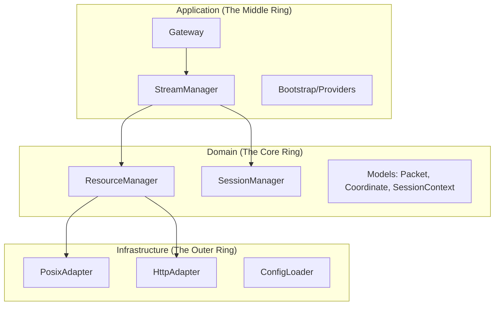
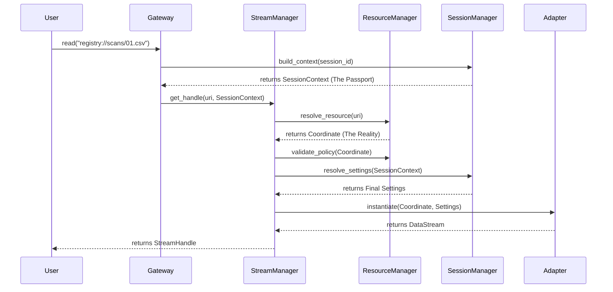

# Architecture Overview: The Slalom Gateway

Welcome to the **Slalom** Architecture. This document serves as the high-level orientation for the system. It defines the mental models, terminology, and structural boundaries that govern how data moves from a URI to a traceable stream.

---

## 1. System Metaphors

To understand Slalom, you must understand its two primary metaphors:

*   **The Smart Gateway:** The framework acts as a mediator (the Gateway) that negotiates **Capabilities**, injects **Context** (the Passport), and enforces **Security Boundaries** (the Gates).
*   **The Slalom:** Data does not just "flow" through a pipe; it **slaloms** through a managed course. It navigates precisely through Security Policies and Middleware Interceptors to reach its destination safely and traceably.

---

## 2. The Structural Map (The "Where")

Slalom follows **Hexagonal Architecture** (Ports & Adapters) and **Clean Architecture** principles.

---

## 3. The "Golden Path" (The "How")

This sequence diagram illustrates the lifecycle of a request through the Slalom Gateway.

---

## 4. Sub-system Index

For deep dives into specific logic, refer to the specialized documentation:

### Core Systems
*   [**Resource Identity**](./resource_identity.md): How strings become Coordinates.
*   [**Session & Context**](./context_and_settings.md): The "Passport" and the "Settings Waterfall."
*   [**Traceability**](./traceability.md): End-to-end observability strategy.
*   [**Middleware**](./middleware.md): How we process packets in-flight.

### Usage & Examples
*   [**Getting Started**](../examples/stream_client.md)
*   [**Working with SessionContext**](../examples/session_context.md)
*   [**Resource Identity Examples**](../examples/resource_subsystem.md)
