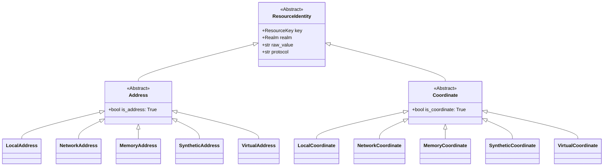

# Resource Identity Genealogy

This document codifies the class hierarchy and architectural roles within the **Resource Identity** subsystem. It defines how raw strings are promoted into structured "Value Objects" and how they are vetted before reaching a DataStream Adapter.

---

## 1. Core Genealogy (Class Hierarchy)

The system uses **Formal Type Inheritance** to enforce contracts, replacing the legacy `Union` type-aliasing with a Realm-based taxonomy.

---

## 2. Component Definitions

### A. The Abstractions (The "Roles")

| Class | Role | Contract |
| :--- | :--- | :--- |
| **`ResourceIdentity`** | **The Root** | Every resource must provide a `ResourceKey` (Nickname/Alias) and a `Realm`. |
| **`Address`** | **The Intent** | Represents an incoming "Intent" (a URI string). It represents a reference that needs resolution. |
| **`Coordinate`** | **The Reality** | Represents a "Physical Reality." It represents data that is physically ready for I/O. |

### B. The Realms (The "Taxonomy")

| Realm | Description | Example Address | Example Coordinate |
| :--- | :--- | :--- | :--- |
| **`LOCAL`** | Local Filesystem | `posix://scans/file.csv` | `/srv/data/scans/file.csv` |
| **`NETWORK`** | Remote/API | `https://api.io/data` | `https://api.io/data` |
| **`MEMORY`** | In-Process RAM | `memory://cache/key` | `<memory_reference>` |
| **`SYNTHETIC`** | Procedural | `synthetic://gen/type` | `<generator_id>` |
| **`VIRTUAL`** | Logical/Registry | `virtual://registry/item` | `registry_path` |

---

## 3. Resource Manager (The Service)

The `ResourceManager` operates as a central **Domain Service** that manages the lifecycle of a resource from string to coordinate.

### Responsibilities:
1.  **Orchestration:** Coordinates between the `ResourceFactory` (classification) and `ResourceCatalog` (resolution).
2.  **Discovery:** Determines the protocol and appropriate realm for a given input.
3.  **Promotion:** Elevates a raw string `uri` -> `Address` -> `Coordinate`.
4.  **Policy Enforcement:** Interfaces with `StreamPolicy` to ensure the requested resource is accessible within the current context.

### Workflow:
1.  **Input:** User provides a string (e.g., `registry://scans/data.csv`).
2.  **Classification:** `ResourceFactory` promotes it to a `LocalAddress`.
3.  **Resolution:** `ResourceCatalog` resolves the `LocalAddress` (Intent) into a `LocalCoordinate` (Reality) by checking anchors and boundaries.
4.  **Output:** A verified `Coordinate` object ready for the `StreamManager`.

---

## 4. Architectural Enforcement

1.  **Contractual Inheritance:** Every implementation must inherit from its respective "Role" (`Address` or `Coordinate`).
2.  **Behavioral Validation:** The `StreamManager` must only accept objects that inherit from `Coordinate`.
3.  **No Primitive Obsession:** Raw strings must be promoted to the appropriate genealogy class before being passed between managers.
4.  **Realm Purity:** Transitions between realms (e.g., resolving a `VirtualAddress` to a `LocalCoordinate`) are explicitly managed by the `ResourceCatalog`.
