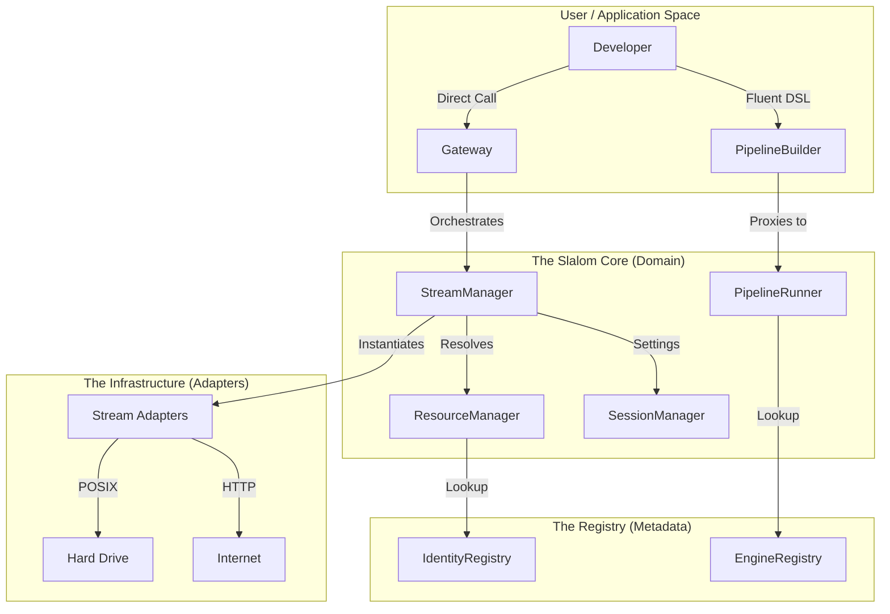
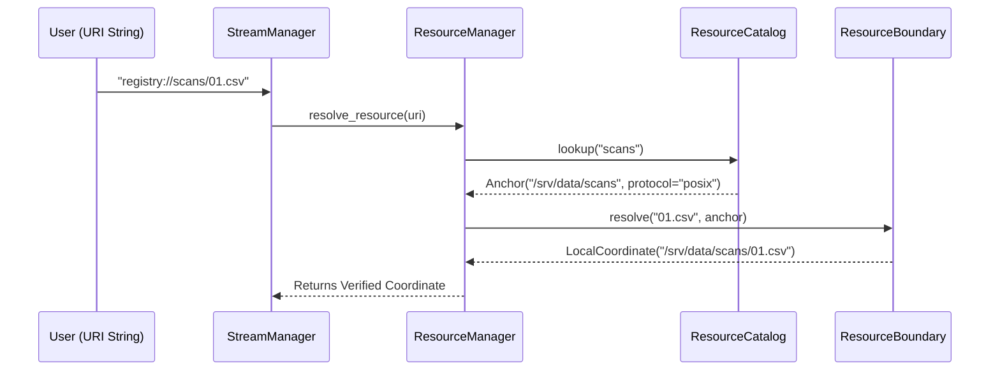
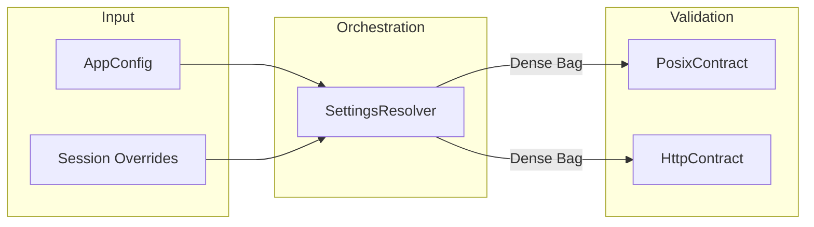
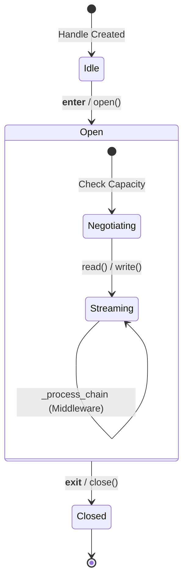

# Slalom System Breakdown

This document provides a high-fidelity map of the Slalom framework. It is designed to reduce cognitive load by separating the system into logical, independent subsystems.

---

## 1. Master Architectural Overview (Hexagonal)

The Slalom framework follows a **Hexagonal (Ports & Adapters)** pattern. The Domain remains "pure," while the Infrastructure handles the messy reality of filesystems and networks.

---

## 2. Subsystem: Resource Identity (The "What")

This system is responsible for knowing exactly where data is and whether we are allowed to touch it.

*   **Address:** What the user *thinks* they want (e.g., `registry://scans/data.csv`).
*   **Coordinate:** The absolute physical reality (e.g., `/srv/data/scans/data.csv`).
*   **Boundary:** The "Chroot" guard that prevents directory traversal.

---

## 3. Subsystem: The Settings Waterfall (The "How")

This system ensures that every stream has exactly the settings it needs (chunk size, timeouts, etc.) based on global defaults and per-call overrides.

*   **AppConfig:** Global "Immutable" defaults.
*   **SessionContext:** The "Passport" that carries the `trace_id` and specific overrides.
*   **Contract:** The adapter-specific "Sieve" that validates the final settings.

---

## 4. Subsystem: The Stream Lifecycle (The "Muscle")

This is where the `Gateway` interacts with the `StreamHandle` to perform I/O.

---

## 5. Summary of Responsibilities

| Subsystem | Key Classes | Responsibility |
| :--- | :--- | :--- |
| **Gateway** | `Gateway` | The Facade. Hides complexity and provides the "Golden Path" API. |
| **Orchestration** | `StreamManager`, `PipelineRunner` | The Brain. Connects identity, settings, and adapters together. |
| **Identity** | `ResourceManager`, `ResourceCatalog` | The Librarian. Maps logical nicknames to physical locations. |
| **Session** | `SessionManager`, `SettingsResolver` | The Diplomat. Manages traceability and config merging. |
| **Infrastructure** | `PosixFileStream`, `HttpStream` | The Workers. Perform the actual socket/disk I/O. |
| **Middleware** | `MiddlewareProcessor`, `Packet` | The Transformers. Modify data in-flight without breaking lineage. |
