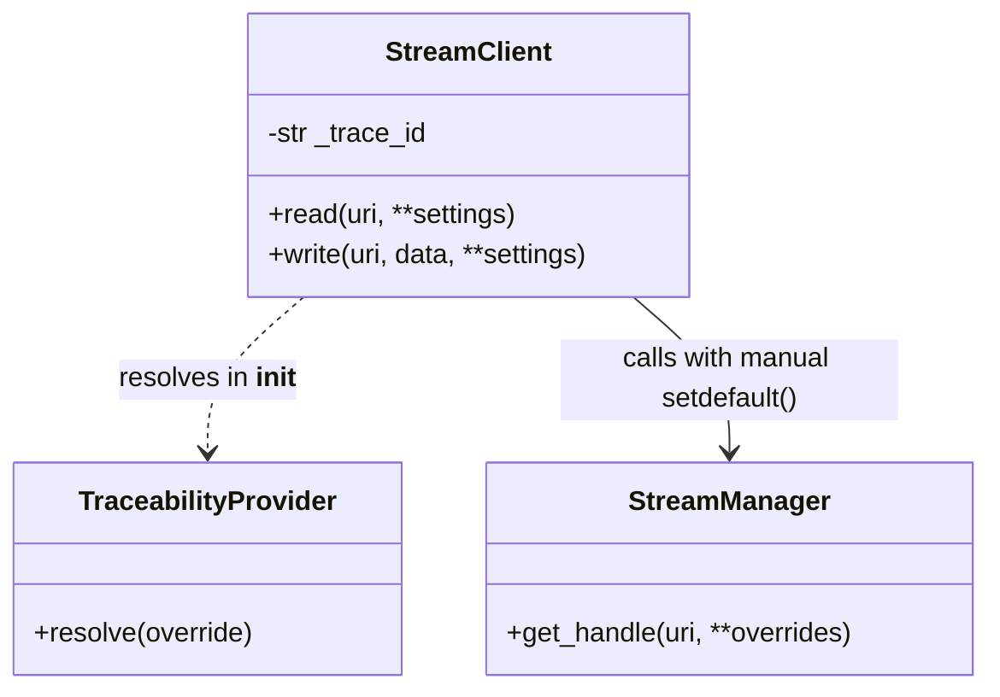
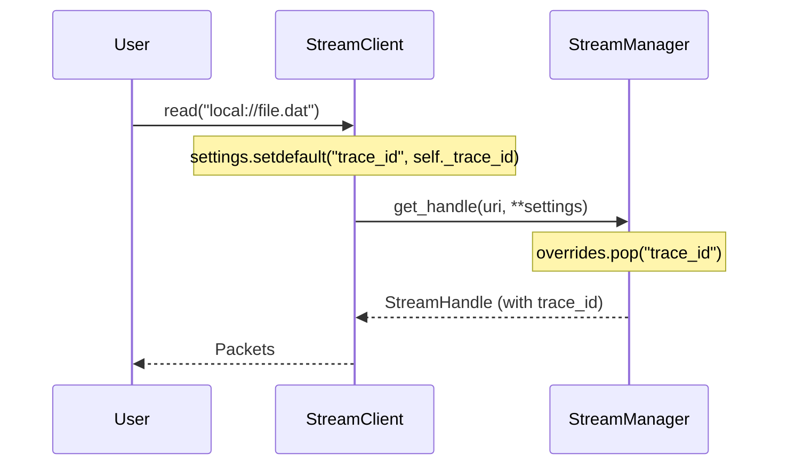
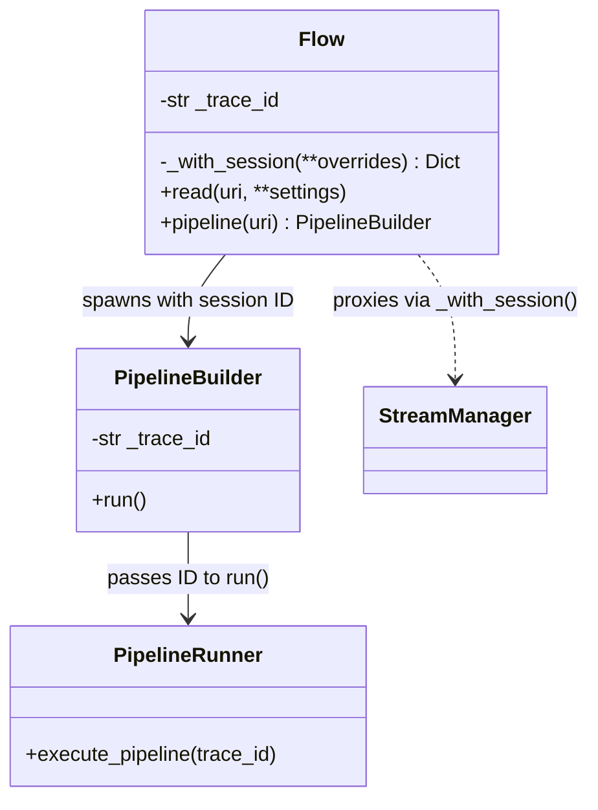
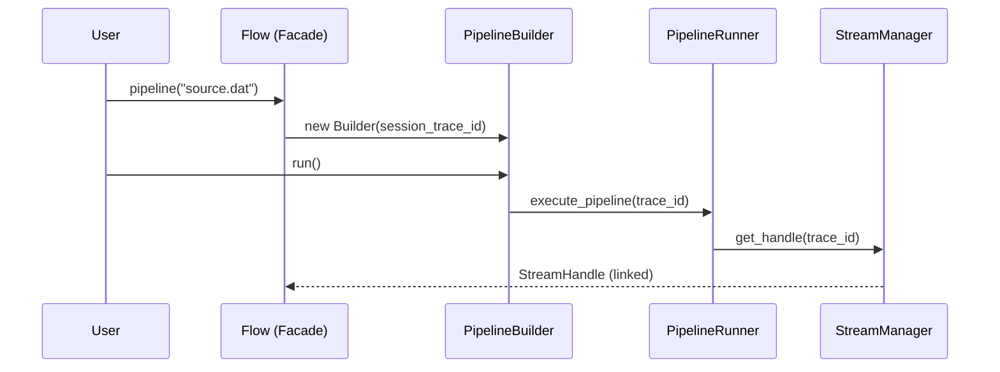

# Traceability Strategy: The `trace_id` Lifecycle

This document outlines the architecture of traceability within the **Slalom** framework, comparing the legacy implementation with the refined session-based approach.

---

## 1. What is the `trace_id`?

The `trace_id` is a **Correlation ID**. It is a unique, short-lived identifier (typically a 12-character UUID) that acts as the "Passport Number" for data as it moves through the system.

### Purpose:
- **Observability:** Link logs from different adapters (e.g., an HTTP read and a POSIX write) into a single logical "event."
- **Debugging:** If a pipeline fails midway, the `trace_id` allows an engineer to filter all system logs to see exactly what happened to that specific batch of data.
- **Context Awareness:** It allows the `StreamManager` to distinguish between multiple concurrent streams.

---

## 2. Legacy Flow (The "Repetitive" Pattern)

In the previous `StreamClient` implementation, the `trace_id` was resolved at initialization and then manually injected into every method call.

### Class Diagram (Old)

### Sequence Diagram (Old)

**Critique:** Every single method in the Facade (`read`, `write`, `get_handle`, `pipeline`) had to remember to call `setdefault`. This led to code duplication and high risk of "trace-leak" (where a method forgets the ID and a new one is generated, breaking the chain).

---

## 3. Refactored Flow (The "Session Context" Pattern)

In the new `Flow` client, we treat the `trace_id` as part of a **Session Context**. The Facade centralizes the injection logic.

### Class Diagram (New)

### Sequence Diagram (New)

### Why this is better:
1.  **Centralized Logic:** The `_with_session` private helper ensures that any future session-level defaults (like `tenant_id` or `priority`) can be added in one place.
2.  **Explicit Contracts:** `PipelineBuilder` and `PipelineRunner` now take `trace_id` as an explicit argument rather than hiding it in a "messy bag" of `**settings`.
3.  **Consistency:** The `Flow` client ensures that every resource interaction within its lifetime is logically linked.

---

## 4. Resolution Hierarchy

The `trace_id` is resolved using a **Coalescing Strategy** in `TraceabilityProvider.resolve()`:

1.  **Method Override:** If a user passes `trace_id="FIXED-ID"` to a specific `.read()` call, it wins.
2.  **Session Default:** The `trace_id` assigned to the `Flow` instance at startup.
3.  **Environment/System:** (Future) Trace IDs from environment variables or parent process headers.
4.  **Automatic Generation:** A fresh UUID if nothing else is provided.
