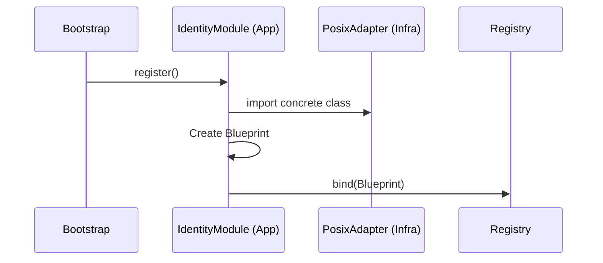
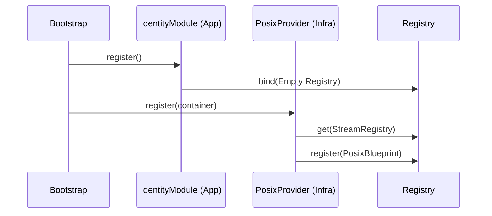

# Design Proposal: Infrastructure Plugin Pattern

**Status:** Proposed / Long-term Refactor  
**Focus:** Decoupling the Composition Root from Concrete Adapters

---

## 1. Problem Statement
Currently, the `IdentityModule` (located in the `app/` layer) imports concrete classes from the `infrastructure/` layer to register them in the `StreamRegistry`. While this is acceptable for a "Composition Root," it creates a **static dependency leak** where the inner application ring must "know" about every possible infrastructure adapter.

As the number of supported protocols (S3, SQL, Redis, etc.) grows, the `IdentityModule` will become a "God Object" of imports, making the codebase harder to maintain and test in isolation.

---

## 2. The "Pure" Strategy: Plugin Pattern
To achieve 100% architectural purity, we propose moving the responsibility of registration from the `app/` layer to the `infrastructure/` layer itself.

### Key Changes:
1.  **Inverse Registration:** The `IdentityModule` provides the "Bucket" (the Registry and Catalog instances).
2.  **Infrastructure Modules:** Each adapter (e.g., `posix_file`) provides its own `AppModule` implementation.
3.  **Discovery:** The `Bootstrap` class enrolls these infrastructure-specific modules alongside the core application modules.

### Proposed Directory Structure:
```text
src/infrastructure/adapters/posix_file/
├── adapter.py
├── boundary.py
├── policy.py
└── provider.py  <-- NEW: Concrete AppModule for this adapter
```

---

## 3. The Refactored Lifecycle

### Current (Manual Wiring):


### Proposed (Plugin Pattern):


---

## 4. Implementation Details

### The Infrastructure Provider
```python
# src/infrastructure/adapters/posix_file/provider.py
class PosixStreamProvider(AppModule):
    def register(self, container: ServiceContainer) -> None:
        registry = container.get(StreamRegistry)
        catalog  = container.get(ResourceCatalog)

        registry.register(
            protocol="posix",
            adapter_cls=PosixFileStream,
            realm=Realm.LOCAL,
            policy=PosixFilePolicy()
        )
        catalog.register("posix", PosixResourceBoundary())
```

### The New Bootstrap Sequence
```python
# src/app/bootstrap.py
modules = [
    ConfigModule(),
    IdentityModule(),  # Provides the empty registries
    PosixStreamProvider(), # Registers POSIX into the identity registries
    HttpStreamProvider(),  # Registers HTTP into the identity registries
    StreamModule(),    # Consumes the now-full registries
]
```

---

## 5. Recommendation
*   **Short-term:** Maintain the current **Manual Wiring** in `IdentityModule`. It provides a single, explicit source of truth for all supported protocols, which is easier for small teams to audit.
*   **Long-term:** Move to the **Plugin Pattern** once the project supports >5-10 adapters or when third-party/external adapter support is required.
