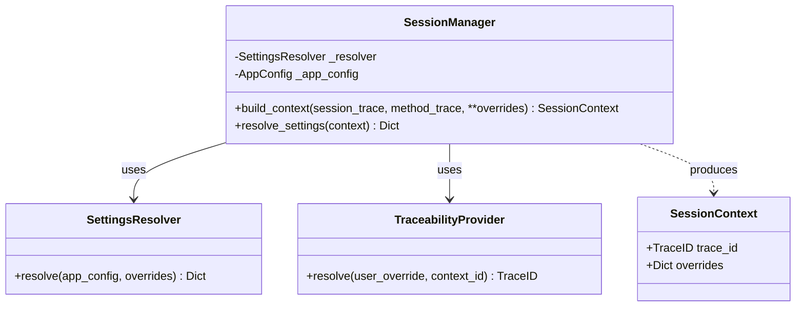
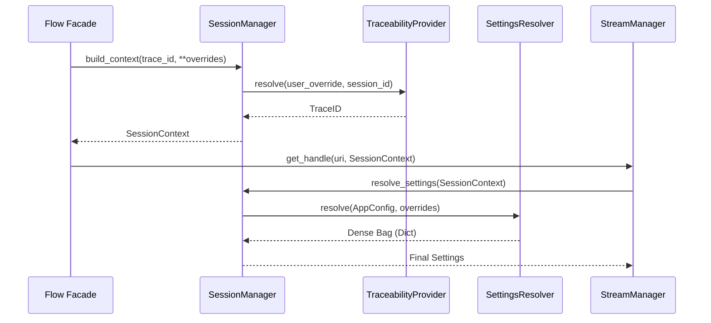

# Status Report: Session Context & Traceability Subsystem

**Last Updated:** Thursday, March 19, 2026  
**Status:** Functional / Refactored
**Component:** `SessionManager` & `SessionContext`

---

## 1. Executive Summary
The Session Context subsystem has been fully refactored to align with the project's directory structure and naming conventions. The "Orchestrator" naming collision has been resolved by renaming the primary facade to `SessionManager`. Integration with the `StreamManager` is complete, establishing a clear delegation of settings resolution and traceability.

---

## 2. Key Findings & Resolutions

### A. Directory & Path Alignment (Resolved)
The physical files and import paths are now synchronized.
- **Physical Path:** `src/app/domain/services/session_context/manager.py`
- **Standardized Export:** `from src.app.domain.services.session_context import SessionManager`
- **`__init__.py`:** Now exists and properly exports the subsystem's public API.

### B. Naming Collision (Resolved)
The architecture now uses consistent "Manager" suffixes for subsystem facades:
1.  **`ResourceManager`**: Handles Identity, Resolution, and Mapping (The "What").
2.  **`SessionManager`**: Handles Session, Traceability, and Settings (The "Who/How").

### C. Implementation Gaps (Resolved)
The `StreamManager` now strictly delegates its settings resolution logic to the `SessionManager`, removing redundant code and centralizing the "Settings Waterfall" logic.

---

## 3. Class Diagram (Updated)

---

## 4. Execution Flow (Settings Resolution)

---

## 5. Completed Tasks
- [x] Rename `ContextOrchestrator` to `SessionManager`.
- [x] Standardize exports in `src/app/domain/services/session_context/__init__.py`.
- [x] Fix import paths in `container.py` and `providers/config.py`.
- [x] Refactor `StreamManager` to consume `SessionContext` via `SessionManager`.

---

## 6. Next Steps
- [x] Verify implementation with unit tests.
- [ ] Update remaining architectural documentation to reflect new naming.
- [ ] Implement advanced traceability logging using the `SessionContext`.
