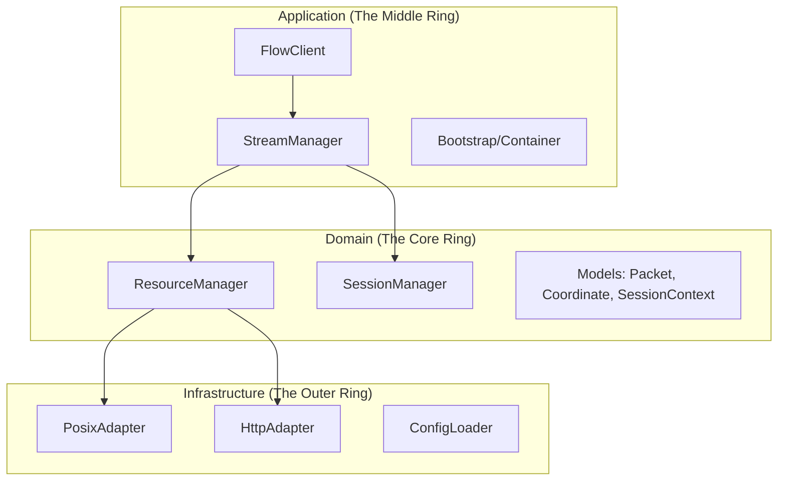
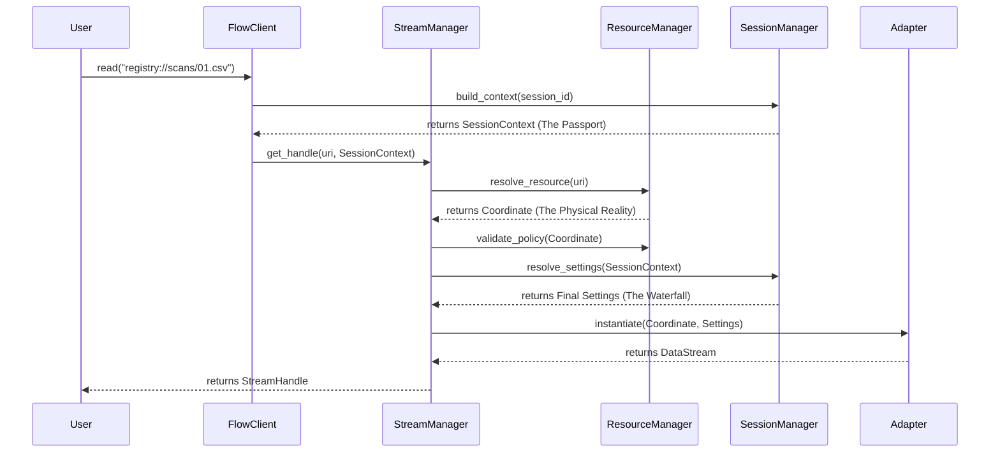
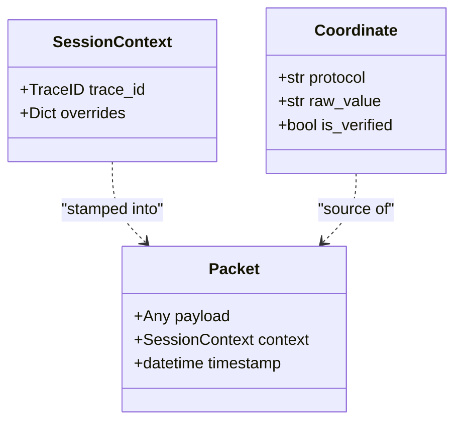

# Architecture Overview: The Smart Gateway

Welcome to the **StreamFlow** Architecture. This document serves as the high-level orientation for the system. It defines the mental models, terminology, and structural boundaries that govern how data moves from a URI to a traceable stream.

---

## 1. System Metaphors

To understand StreamFlow, you must understand its two primary metaphors:

*   **The Smart Gateway:** The framework is not a "dumb" pipe. It acts as a mediator (the Gateway) that negotiates **Capabilities** (what can this stream do?), injects **Context** (who is asking?), and enforces **Security Boundaries** (where are they allowed to look?).
*   **The Passport:** Every request generates a `SessionContext`. This is the "Passport" that travels with every data packet. It carries the identity, traceability, and ephemeral settings required to navigate the infrastructure layer.

---

## 2. The Structural Map (The "Where")

StreamFlow follows **Hexagonal Architecture** (Ports & Adapters) and **Clean Architecture** principles.

*   **Domain:** Contains the "Pure Reality" of the business. No I/O, no networking. Just models and business logic.
*   **Application:** Orchestrates the domain services to fulfill user intent (Use Cases).
*   **Infrastructure:** Contains the mechanical "How." This is where filesystem access, HTTP requests, and logging occur.

---

## 3. The "Golden Path" (The "How")

This sequence diagram illustrates the lifecycle of a primary request: from a raw URI string to a traceable Smart Handle.

---

## 4. The Entity Genealogy (The "What")

The "DNA" of the system is comprised of three core Value Objects that maintain integrity across layers.

---

## 5. Ubiquitous Language

Consistent terminology is critical for developer efficiency.

| Term | Definition |
| :--- | :--- |
| **`Address`** | The **Intent**. A URI string or object representing a *requested* resource. |
| **`Coordinate`** | The **Reality**. A verified, physical location (Path/URL) ready for I/O. |
| **`Packet`** | The **Unit of Work**. A self-aware data wrapper carrying a payload and its `SessionContext`. |
| **`Handle`** | The **Dashboard**. A high-level object providing introspection (`Capacity`) and lifecycle management. |
| **`SessionContext`** | The **Passport**. The metadata (TraceID + Overrides) that travels with the data. |

---

## 6. Sub-system Index

For deep dives into specific logic and edge cases, refer to the specialized documentation:

### Core Systems
*   [**Resource Identity**](./resource_identity.md): How strings become Coordinates.
*   [**Session & Context**](./context_and_settings.md): The "Passport" and the "Settings Waterfall."
*   [**Traceability**](./traceability.md): End-to-end observability strategy.
*   [**Middleware**](./middleware.md): How we process packets in-flight.

### Framework Standards
*   [**Provider Pattern**](./standards/provider_pattern.md): How we handle dependency injection.
*   [**Versioning**](./standards/versioning.md): How we manage API evolution.

### Usage & Examples
*   [**Getting Started**](../examples/stream_client.md)
*   [**Working with SessionContext**](../examples/session_context.md)
*   [**Resource Identity Examples**](../examples/resource_subsystem.md)
