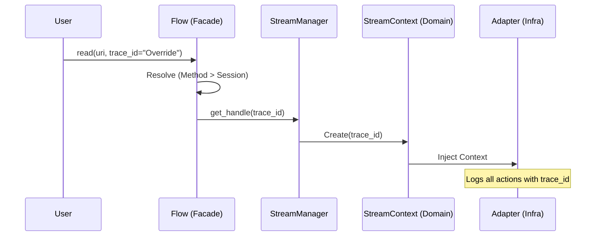
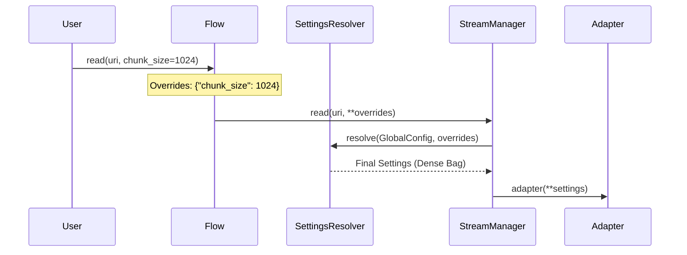

# Context & Settings Architecture

This document codifies the management of **Identity (Traceability)** and **Configuration (Settings)** across the StreamFlow ecosystem.

## 1. Vocabulary & Intent

| Term | Domain | Responsibility | Format |
| :--- | :--- | :--- | :--- |
| **`trace_id`** | Identity | Correlation ID for logs/events. | String (UUID-12) |
| **`overrides`** | Intent | User-provided changes to defaults. | Sparse Dict |
| **`settings`** | Reality | Final, resolved protocol configuration. | Dense Dict |
| **`AppConfig`** | Baseline | System-wide global defaults. | Dataclass |
| **`SessionState`** | Context | The identity and config of the `Flow` instance. | Dataclass |

---

## 2. Component Mapping

| Service / Property | Current Location | New Role |
| :--- | :--- | :--- |
| **`TraceabilityProvider`** | `src/app/domain/services/` | **Identity Generator:** Low-level UUID logic. |
| **`SettingsResolver`** | `src/app/domain/services/` | **The Waterfall Engine:** Merges Bags (Global + Overrides). |
| **`SessionState`** | *(New)* | **The Passport:** Holds the `Flow` instance's identity. |
| **`StreamManager`** | `src/app/use_cases/` | **The Promoter:** Converts Context IDs into `StreamContext` objects. |

---

## 3. The Progression Flow (Diagrams)

### A. Identity Progression (`trace_id`)
The `trace_id` starts as a string and is promoted to a Domain Object (`StreamContext`) before reaching the Adapters.

### B. Configuration Progression (`overrides` -> `settings`)
The "Bag" transitions from a sparse user-intent dictionary to a dense system-reality dictionary.

---

## 4. Architectural Rules

1.  **Identity is First-Class:** Every public method in `Flow` must accept an explicit `trace_id: Optional[str] = None`. It must **never** be hidden solely in a `**kwargs` bag at the entry point.
2.  **Explicit Promotion:** Orchestrators (`StreamManager`, `PipelineRunner`) are responsible for promoting raw strings (`trace_id`) into structured Domain Objects (`StreamContext`, `PipelineBlueprint`).
3.  **The "Bag" is for Adapters:** Only the final Infrastructure Adapters should receive a "Dense Bag" of settings. Intermediate services should use structured objects whenever possible.
