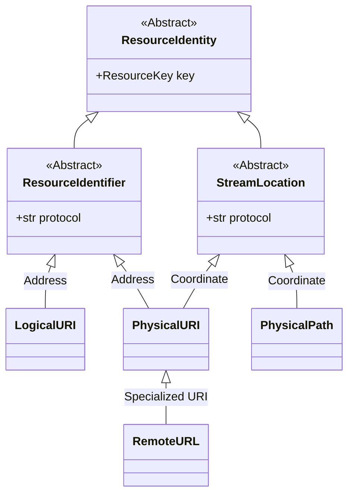

# Resource Identity Genealogy

This document codifies the class hierarchy and architectural roles within the **Resource Identity** subsystem. It defines how raw strings are promoted into structured "Value Objects" and how they are vetted before reaching a DataStream Adapter.

---

## 1. Core Genealogy (Class Hierarchy)

The system uses **Formal Type Inheritance** to enforce contracts, replacing the legacy `Union` type-aliasing.

---

## 2. Component Definitions

### A. The Abstractions (The "Roles")

| Class | Role | Contract |
| :--- | :--- | :--- |
| **`ResourceIdentity`** | **The Root** | Every resource must provide a `ResourceKey` (Nickname/Alias). |
| **`ResourceIdentifier`** | **The Address** | Represents an incoming "Intent" (a URI string). It must be resolvable. |
| **`StreamLocation`** | **The Coordinate** | Represents a "Physical Reality." It must provide a `protocol` string. |

### B. The Implementations (The "Behaviors")

| Class | Category | Example | Logic |
| :--- | :--- | :--- | :--- |
| **`LogicalURI`** | Identifier | `registry://scans/` | Requires the `ResourceCatalog` to resolve to a path. |
| **`PhysicalURI`** | Hybrid | `s3://bucket/` | Both an Identifier (Address) and a Location (Coordinate). |
| **`RemoteURL`** | Hybrid | `https://vault.io/` | A specialized `PhysicalURI` for network transports. |
| **`PhysicalPath`** | Location | `/srv/data/` | A local coordinate vetted by a `ResourceBoundary`. |

---

## 3. The "Dual Nature" of PhysicalURIs

A key architectural feature is the **Hybrid Nature** of `PhysicalURI`. 
- Because it contains a scheme (`s3://`, `http://`), it is a valid **Identifier** (Address). 
- Because it is a direct coordinate, it is also a valid **StreamLocation** (Coordinate). 

This allows the `ResourceOrchestrator` to skip the "Resolution" step for Physical URIs and pass them directly to the `StreamManager`.

---

## 4. Architectural Enforcement

1.  **Contractual Inheritance:** Every implementation must inherit from its respective "Role" (Identifier or Location).
2.  **Behavioral Validation:** The `StreamManager` must only accept objects that inherit from `StreamLocation`. This ensures the object has a `protocol` property.
3.  **No Primitive Obsession:** Raw strings must be promoted to the appropriate genealogy class before being passed between orchestrators.
