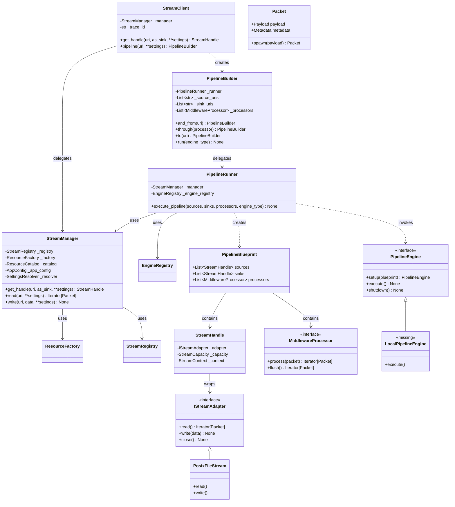
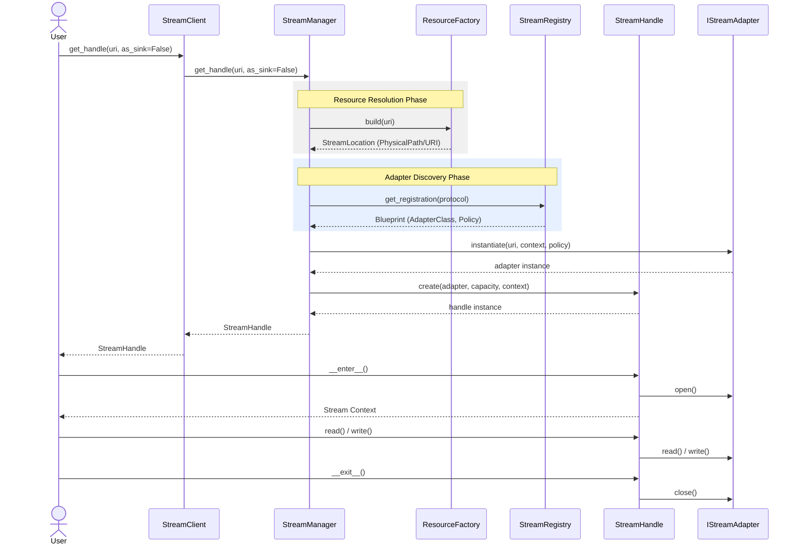
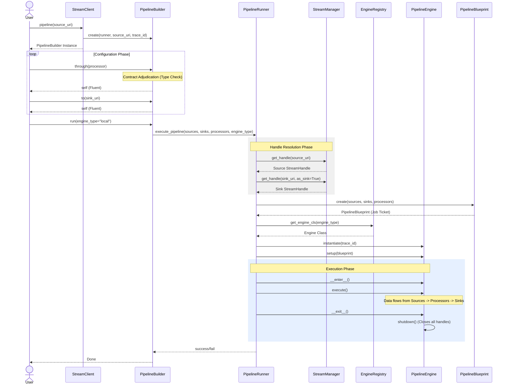
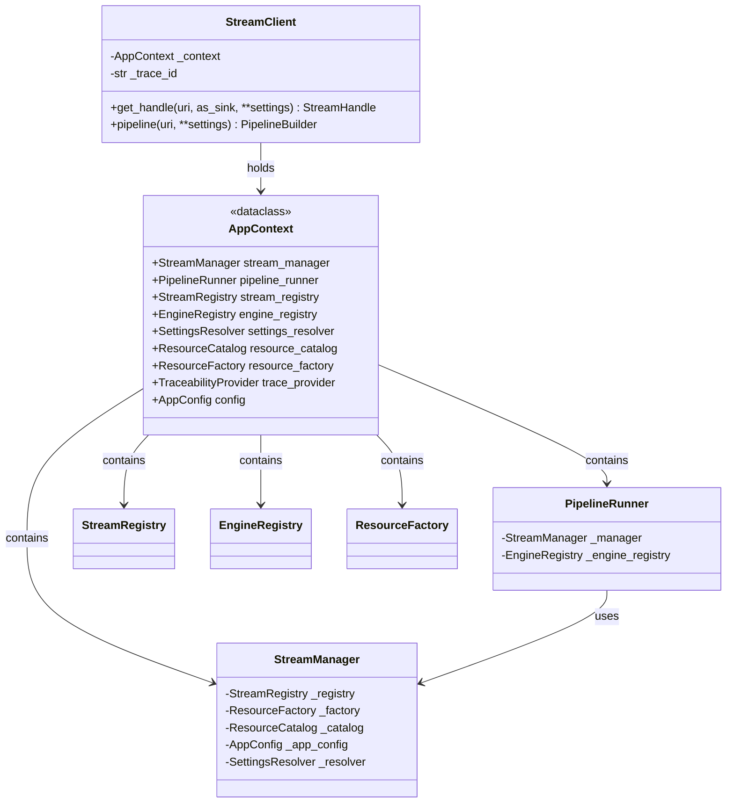
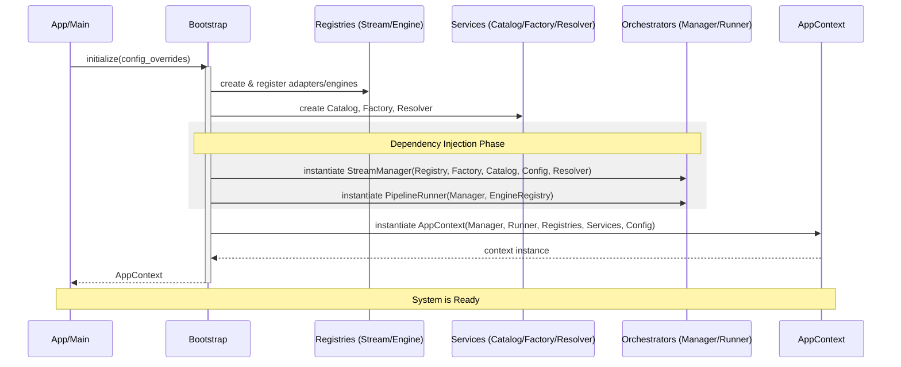

# StreamFlow Architecture Map

## Application Summary
**StreamFlow** is a context-aware data streaming and pipeline orchestration framework built on Clean Architecture principles. It provides a unified interface for interacting with diverse storage protocols (Local POSIX, HTTP, etc.) while maintaining high traceability and type safety through its pipeline transformation engine.

### Core Architectural Patterns
- **Ports & Adapters (Hexagonal Architecture):** Decouples business logic from infrastructure.
- **Pipe-and-Filter:** Used in the Pipeline Subsystem for modular data transformation.
- **Fluent DSL:** Provided via `PipelineBuilder` for an expressive developer experience.
- **Smart Gateway Orchestrator:** `StreamManager` manages the lifecycle and resolution of resources.

---

## Component Status Table

| Component | Layer | Role | Status | Notes |
| :--- | :--- | :--- | :--- | :--- |
| **StreamClient** | Application (Facade) | User entry point | 🟢 Partial | `pipeline()` method is a placeholder. |
| **StreamManager** | Application (Use Case) | Orchestrates resource lifecycle | 🟢 Complete | Core logic for handle resolution and policy checks. |
| **PipelineBuilder** | Application (Use Case) | DSL for pipeline definition | 🟢 Complete | Handles contract adjudication. |
| **PipelineRunner** | Application (Use Case) | Orchestrates pipeline execution | 🟢 Complete | Needs integration into `Bootstrap`. |
| **ResourceFactory** | Domain Service | Promotes URIs to Locations | 🟢 Complete | Handles Logical to Physical translation. |
| **ResourceCatalog** | Domain Service | Protocol/Boundary storage | 🟢 Complete | Stores protocol metadata. |
| **StreamRegistry** | Application (Registry) | Maps protocols to adapters | 🟢 Complete | Stores Adapter and Policy blueprints. |
| **EngineRegistry** | Application (Registry) | Stores pluggable execution engines | 🟡 Buggy | Naming mismatch (`get_engine` vs `get_engine_cls`). |
| **PipelineEngine** | Port (Output) | Execution Strategy Interface | 🟢 Complete | Abstract interface for engines. |
| **LocalPipelineEngine** | Infrastructure (Engine) | Sequential execution engine | 🔴 Missing | Implementation not found in `src/infrastructure/engines`. |
| **MiddlewareProcessor** | Port (Output) | Transformation Interface | 🟢 Complete | Unified interface for filters. |
| **ChecksumProcessor** | Infrastructure (Proc) | Verifies data integrity | 🟢 Complete | Example implementation of middleware. |
| **PosixFileStream** | Infrastructure (Adapter) | Local File System Adapter | 🟢 Complete | Protocol: `posix`, `file`. |
| **HttpStream** | Infrastructure (Adapter) | HTTP/S Remote Adapter | 🟢 Complete | Protocol: `http`, `https`. |

---

## System Architecture (Class Diagram)

---

## User Flow Diagram (System Entry)

This diagram maps the flow of a user requesting a resource handle or starting a pipeline through the `StreamClient`.

---

## User Flow Diagram (Pipeline Building & Execution)

This diagram illustrates the fluent interface for constructing a pipeline and the subsequent orchestration of its execution.

---

## Future Architecture (With ApplicationContext)

This section maps the planned transition to using the `AppContext` as the central runtime container for all system dependencies.

### Class Diagram (Evolution)

### Bootstrapping Flow (With AppContext)

This diagram shows the "Big Bang" initialization process where all components are wired and injected into the `AppContext`.

### Planned Refactoring Changes (ApplicationContext)

The transition to the `AppContext` will involve the following specific implementation changes:

1.  **Bootstrap Return Type:** `Bootstrap.initialize()` will be refactored to return the `AppContext` dataclass instead of a raw `StreamManager`.
2.  **StreamClient Internal State:** `StreamClient` will replace its `self._manager` reference with `self._context: AppContext`.
3.  **Pipeline Subsystem Wiring:** The `PipelineRunner` and `EngineRegistry` will be initialized and wired within `Bootstrap`, ensuring they are correctly injected into the `AppContext`.
4.  **Facade Delegation:** `StreamClient` convenience methods (`read`, `write`, `get_handle`) will be updated to delegate to `self._context.stream_manager`.
5.  **Pipeline Builder Integration:** The `StreamClient.pipeline()` method will be fully implemented, using `self._context.pipeline_runner` to instantiate the `PipelineBuilder`.
6.  **Dependency Transparency:** Services like `ResourceCatalog`, `SettingsResolver`, and `ResourceFactory` will be explicitly accessible via the `AppContext`, making the system easier to test and extend.
7.  **Engine Registration:** A concrete `LocalPipelineEngine` will be registered in the `EngineRegistry` during the bootstrapping phase to enable actual data processing.

---

## Technical Debt & Observation Log

1.  **Pipeline Subsystem Disconnect:** The `PipelineRunner` and `EngineRegistry` are defined but not wired into the `Bootstrap.initialize` or the `StreamClient`.
2.  **Engine Implementation Gap:** There is no concrete implementation of `PipelineEngine` (e.g., `LocalPipelineEngine`) to perform actual work.
3.  **EngineRegistry Bug:** The `PipelineRunner` calls `get_engine_cls` while the `EngineRegistry` defines `get_engine`.
4.  **Incomplete StreamClient Facade:** `StreamClient.pipeline()` remains a placeholder, preventing user-facing access to the pipeline builder.
5.  **Empty Infrastructure Engine Directory:** `src/infrastructure/engines` is currently empty.
