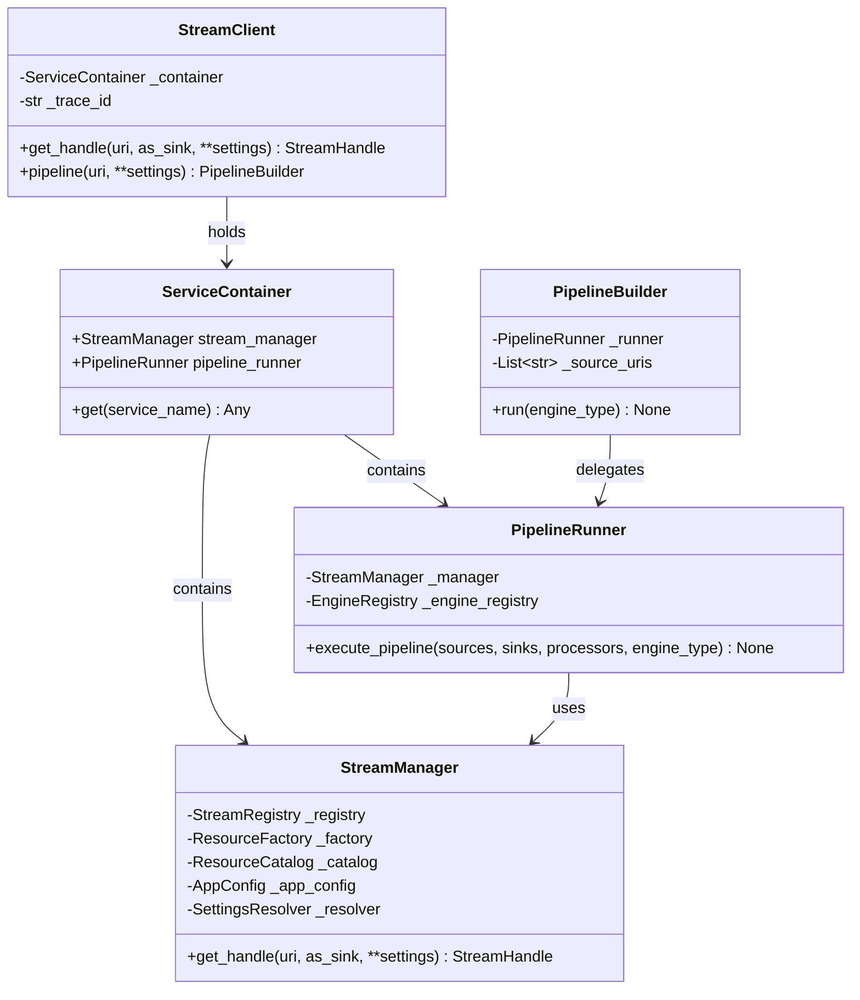
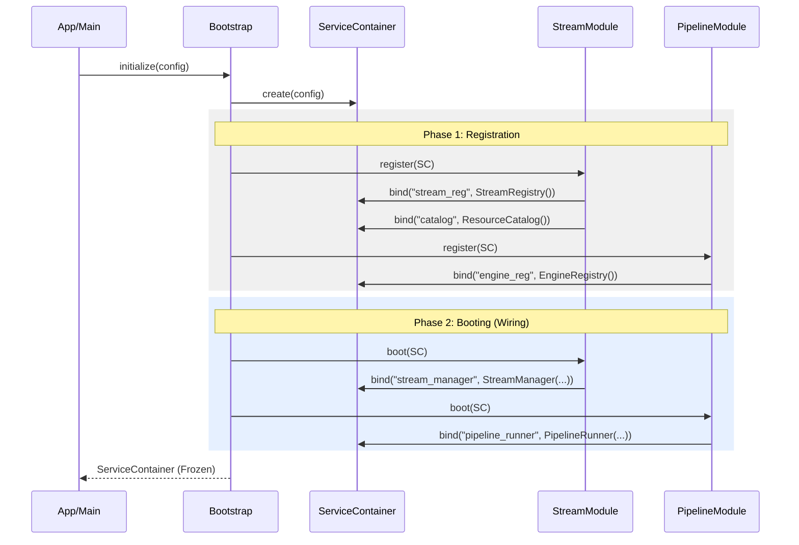

# StreamFlow Architecture Map

## Application Summary
**StreamFlow** is a context-aware data streaming and pipeline orchestration framework built on Clean Architecture principles. It provides a unified interface for interacting with diverse storage protocols (Local POSIX, HTTP, etc.) while maintaining high traceability and type safety through its pipeline transformation engine.

### Core Architectural Patterns
- **Ports & Adapters (Hexagonal Architecture):** Decouples business logic from infrastructure.
- **Pipe-and-Filter:** Used in the Pipeline Subsystem for modular data transformation.
- **Fluent DSL:** Provided via `PipelineBuilder` for an expressive developer experience.
- **Modular Provider Pattern:** Orchestrates system initialization via specialized modules and a central `ServiceContainer`.

---

## Component Status Table

| Component | Layer | Role | Status | Notes |
| :--- | :--- | :--- | :--- | :--- |
| **StreamClient** | Application (Facade) | User entry point | 🟢 Partial | `pipeline()` method is a placeholder. |
| **StreamManager** | Application (Use Case) | Orchestrates resource lifecycle | 🟢 Complete | Core logic for handle resolution and policy checks. |
| **PipelineBuilder** | Application (Use Case) | DSL for pipeline definition | 🟢 Complete | Handles contract adjudication. |
| **PipelineRunner** | Application (Use Case) | Orchestrates pipeline execution | 🟢 Complete | Needs integration into `Bootstrap`. |
| **ResourceFactory** | Domain Service | Promotes URIs to Locations | 🟢 Complete | Handles Logical to Physical translation. |
| **ResourceCatalog** | Domain Service | Protocol/Boundary storage | 🟢 Complete | Stores protocol metadata. |
| **StreamRegistry** | Application (Registry) | Maps protocols to adapters | 🟢 Complete | Stores Adapter and Policy blueprints. |
| **EngineRegistry** | Application (Registry) | Stores pluggable execution engines | 🟡 Buggy | Naming mismatch (`get_engine` vs `get_engine_cls`). |
| **PipelineEngine** | Port (Output) | Execution Strategy Interface | 🟢 Complete | Abstract interface for engines. |
| **LocalPipelineEngine** | Infrastructure (Engine) | Sequential execution engine | 🔴 Missing | Implementation not found in `src/infrastructure/engines`. |
| **MiddlewareProcessor** | Port (Output) | Transformation Interface | 🟢 Complete | Unified interface for filters. |
| **ChecksumProcessor** | Infrastructure (Proc) | Verifies data integrity | 🟢 Complete | Example implementation of middleware. |
| **PosixFileStream** | Infrastructure (Adapter) | Local File System Adapter | 🟢 Complete | Protocol: `posix`, `file`. |
| **HttpStream** | Infrastructure (Adapter) | HTTP/S Remote Adapter | 🟢 Complete | Protocol: `http`, `https`. |

---

## System Architecture (Class Diagram)



---

## Refactor Audit: Removing ApplicationContext

The following locations currently reference the deprecated `ApplicationContext` and must be refactored to use the `ServiceContainer` and `Provider` model.

| File | Location | Context | Refactor Suggestion |
| :--- | :--- | :--- | :--- |
| `src/app/context.py` | Line 14 | `AppContext` Class definition | Replace with dynamic `ServiceContainer`. |
| `src/app/bootstrap.py` | Line 9, 28 | `AppContext` Imports/Returns | Refactor to return `ServiceContainer` via Modular Providers. |
| `src/app/use_cases/pipeline_builder.py` | Line 25 | Docstring | Update reference to `ServiceContainer`. |

---

## Future Architecture (Modular Provider Pattern)

This section maps the transition to a modular system where `StreamModule` and other providers register dependencies into a `ServiceContainer`.

### The StreamModule Refactor

1.  **The Port (Abstract):** Define an `AppModule` interface that mandates `register(container)` and `boot(container)` methods.
2.  **Integration:** `Bootstrap` will iterate through a list of modules, calling `register` to instantiate foundations and `boot` to wire orchestrators.

### Bootstrapping Flow (Modular)



### ServiceContainer Sketch

The `ServiceContainer` acts as a central registry for all initialized services and foundations.

```python
class ServiceContainer:
    def __init__(self, config: AppConfig):
        self._services = {}
        self.config = config

    def bind(self, key: str, instance: Any):
        """Phase 1/2: Add an instance to the container."""
        self._services[key] = instance

    def get(self, key: str) -> Any:
        """Access a service or foundation."""
        return self._services.get(key)

    @property
    def stream_manager(self) -> StreamManager:
        return self.get("stream_manager")
```

---

## User Flow Diagrams...
(Rest of existing diagrams preserved)
