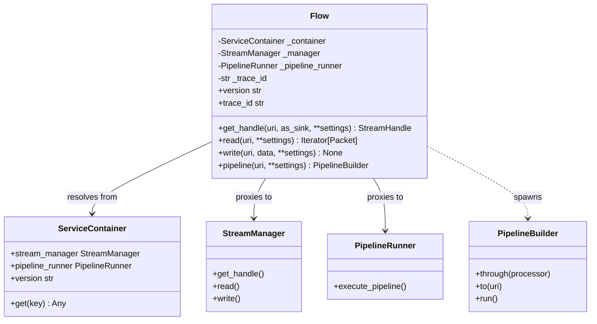
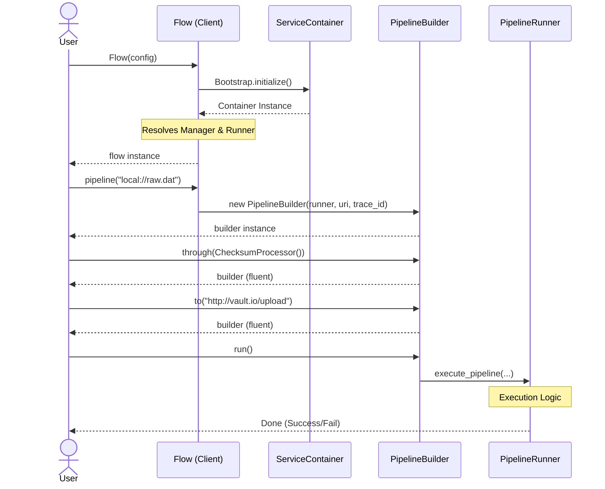

# Flow Client Specification & Usage Guide

**Version:** 2.0.0  
**Status:** Implementation Ready  
**Component:** `Flow` (Facade)

## 1. Overview
The `Flow` class is the primary public entry point for the **StreamFlow** framework. It acts as a high-level facade that orchestrates two distinct subsystems:
1.  **Resource Management:** Handled via the `StreamManager`.
2.  **Pipeline Orchestration:** Handled via the `PipelineRunner`.

By using the `Flow` client, users interact with a single, unified interface that hides the complexity of the underlying **ServiceContainer** and **Modular Provider** architecture.

---

## 2. Class Architecture

### Class Diagram
This diagram shows how the `Flow` client acts as a gateway to the functional engines stored within the `ServiceContainer`.



---

## 3. Implementation Specification

### Initialization (`__init__`)
The constructor establishes the framework's "Big Bang" state while supporting **Inversion of Control (IoC)** for testing.

```python
def __init__(
    self,
    config: Optional[Dict[str, Any]] = None,
    trace_id: Optional[str] = None,
    container: Optional[ServiceContainer] = None
) -> None:
    # 1. Establish Trace Identity
    config_bag = config or {}
    provided_id = trace_id or config_bag.get("trace_id")
    self._trace_id = TraceabilityProvider.resolve(user_override=provided_id)

    # 2. Resolve/Initialize the Container
    if container:
        self._container = container
    else:
        from src.app.bootstrap import Bootstrap
        self._container = Bootstrap.initialize(overrides=config_bag)

    # 3. Eagerly Resolve Orchestrators (for performance)
    self._manager = self._container.stream_manager
    self._pipeline_runner = self._container.pipeline_runner
```

### Core Methods

| Method | Description | Implementation Detail |
| :--- | :--- | :--- |
| **`read(uri, **settings)`** | Reads a stream and yields Packets. | `return self._manager.read(uri, **settings)` |
| **`write(uri, data, **settings)`** | Writes data to a stream. | `return self._manager.write(uri, data, **settings)` |
| **`get_handle(uri, as_sink, **settings)`** | Returns a Smart Handle. | `return self._manager.get_handle(uri, as_sink, **settings)` |
| **`pipeline(uri, **settings)`** | **Factory:** Creates a Pipeline. | `return PipelineBuilder(self._pipeline_runner, uri, self._trace_id)` |
| **`resolve(uri)`** | Resolves Logical to Physical. | `return self._manager.resolve(uri)` |
| **`exists(uri)`** | Checks resource existence. | `return self._manager.exists(uri)` |

---

## 4. User Flow (Sequence)

This diagram illustrates the lifecycle of a user creating a `Flow` instance and executing a multi-step data pipeline.



---

## 5. Example Usages

### Example A: Basic Stream Operations
Directly interacting with files or remote resources using the facade's convenience methods.

```python
from src.app.flow_client import Flow

# 1. Initialize the client
flow = Flow(config={"log_level": "DEBUG"})

# 2. Check for existence
if flow.exists("data://raw_input.json"):
    # 3. Simple Read
    for packet in flow.read("data://raw_input.json"):
        print(f"Processing Packet: {packet.metadata.id}")
```

### Example B: Building a Pipeline
Using the Fluent DSL to construct a transformation workflow.

```python
from src.app.flow_client import Flow
from src.infrastructure.processors.checksum import ChecksumProcessor

flow = Flow()

# Build and run a pipeline in a single fluent chain
flow.pipeline("local://source.bin") \
    .through(ChecksumProcessor()) \
    .to("local://backup.bin") \
    .to("http://remote-storage.com/sink") \
    .run(engine_type="local")
```

### Example C: Accessing System Metadata
Retrieving state and configuration from the underlying container via the facade.

```python
flow = Flow()

print(f"System Version: {flow.version}")
print(f"Active Trace ID: {flow.trace_id}")

# Access raw settings if needed
chunk_size = flow._container.settings.chunk_size
```
