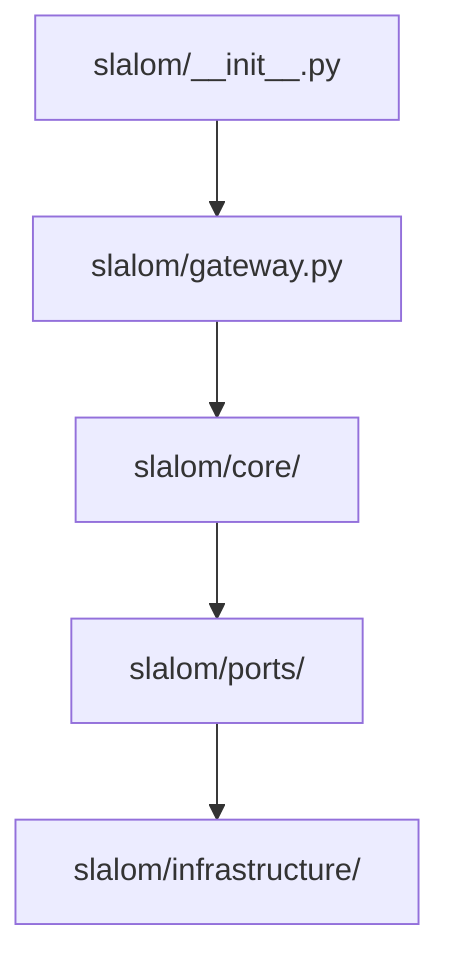

# Overview

This TDD formalizes the "Screaming Hexagonal" directory structure for the Slalom Rebirth. The goal is to collapse the over-engineered multi-manager hierarchy of v0.9.0 into a flattened, intuitive layout that explicitly separates the **Domain** (functional logic) from **Infrastructure** (external I/O) via clear **Ports** (interfaces).

# Proposed Design

### 1. Layered Architecture
The structure is organized by responsibility rather than by technical type, ensuring that the "ETL Nature" of the project is visible from the root.

# Detailed Design: Component Breakdown

## 1. Package Root: `src/slalom/`
The public entry point for the framework.

*   **`__init__.py`**: The "Concierge." Exposes the `Slalom` gateway and core models (`Packet`) to the user, masking internal complexity.
*   **`gateway.py`**: The "Front Door." Implementation of the `Slalom` class. It is the only object a user should instantiate to begin a pipeline.

## 2. The Domain: `src/slalom/core/`
Contains pure functional logic. **Mandate:** Zero dependencies on external libraries (except Pydantic/structlog).

*   **`packet.py`**: The "Smart Unit of Work." Defines the immutable data container and lineage logic.
*   **`engine.py`**: The "Motor." The recursive generator logic that drives packets through the middleware chain.
*   **`builder.py`**: The "Architect." The fluent DSL state-collector that allows the `app.pipeline().through().to()` syntax.

## 3. The Contracts: `src/slalom/ports/`
Defines the Abstract Base Classes (ABCs) that act as the "Laws of Physics" for extensions.

*   **`middleware.py`**: The `MiddlewareProcessor` ABC. Defines how a transformation must behave.
*   **`datastream.py`**: The `DataStream` ABC. Defines how a source or sink must behave (read/write).

## 4. The Adapters: `src/slalom/infrastructure/`
Handles all side-effects and external library integrations.

*   **`resolver.py`**: The "Dispatcher." Uses `fsspec` to map URI strings directly to the appropriate physical adapter.
*   **`adapters/`**: Physical implementations of the `DataStream` port.
    *   **`file.py`**: Local filesystem streaming.
    *   **`http.py`**: Remote network streaming via `httpx`.

# Goals & Non-Goals

### Goals
- **Cognitive Clarity:** A developer should find logic by its functional role (Core vs Port).
- **Enforced Boundaries:** Enable `pytest-archon` to easily detect illegal imports between `core/` and `infrastructure/`.
- **Minimal Nesting:** Limit package depth to 3 layers to reduce import complexity.

### Non-Goals
- **Backwards Compatibility:** This structure intentionally breaks all v0.9.0 paths.
- **Service Layering:** We will not re-introduce `Managers` or `Services`; all logic is consolidated into the `core` components.
