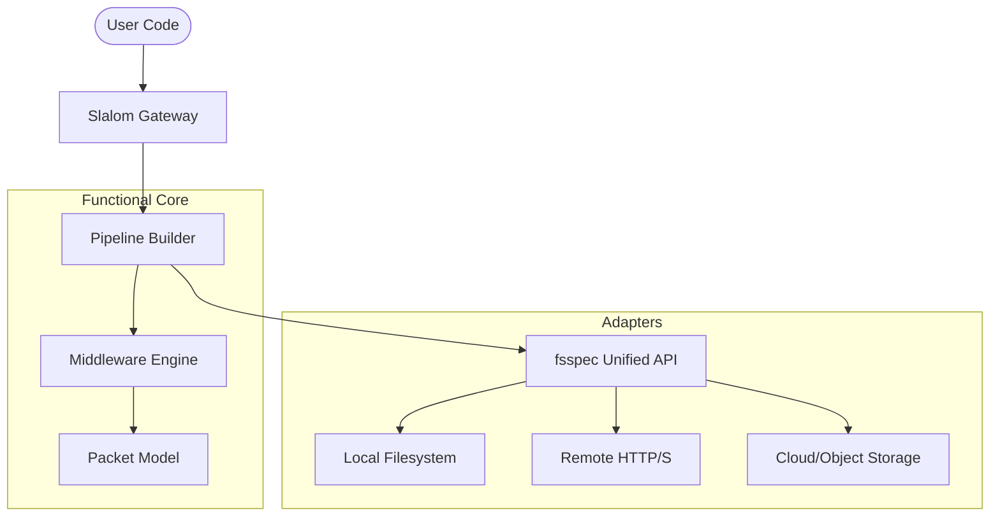
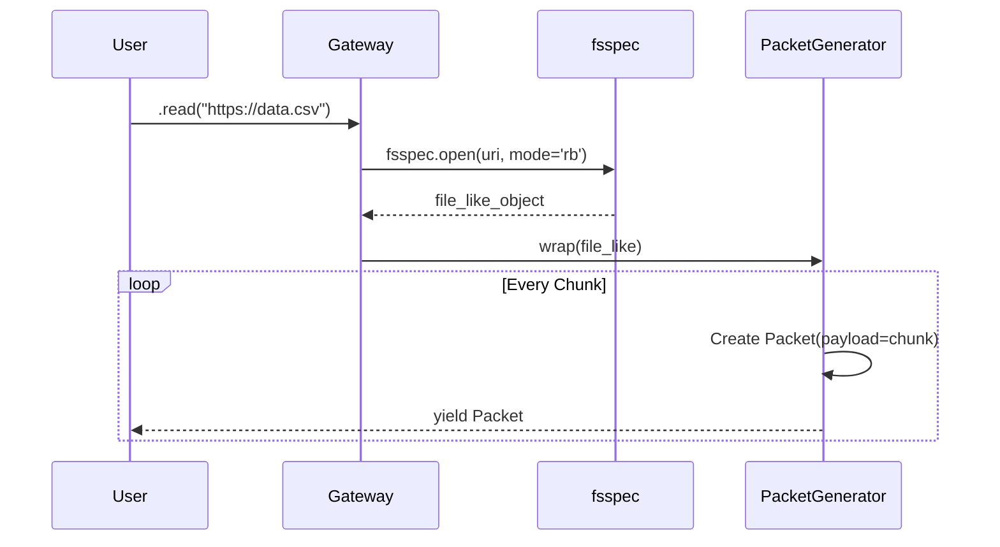

# Overview

This TDD defines the clean-slate implementation of **`fsspec`** (Filesystem Spec) as the singular I/O engine for the Slalom rebirth. All legacy identity resolution code has been removed.

By adopting `fsspec`, we eliminate the need for custom identity subsystems (Realms, Addresses, Coordinates) by utilizing a single industry-standard library. This provides a unified API for local files (`file://`), network resources (`https://`), and cloud storage (S3/GCS), while natively supporting the "Path Sandboxing" requirements of a professional ETL framework.

# Proposed Design

### 1. Component Diagram
The new architecture flattens the hierarchy, using `fsspec` as the bridge between the Smart Gateway and physical storage.



### 2. Sequence Diagram: Streaming ETL
The flow of data from a raw URI to a sequence of traceable Packets.



# Detailed Design

### 1. The Unified Resolver
The complex `ResourceManager` is replaced by a functional utility that leverages `fsspec.get_filesystem_class(protocol)`.

```python
# src/app/core/resolver.py
import fsspec

def get_stream(uri: str, mode: str = "rb", **kwargs):
    """
    Unified entry point for all I/O.
    Returns an fsspec compatible file-like object.
    """
    return fsspec.open(uri, mode=mode, **kwargs)
```

### 2. Path Sandboxing (Anchors)
To retain the "Anchor" logic from v0.9.0, we will use `fsspec`'s native **`DirFileSystem`**. This allows us to "jail" a pipeline to a specific root directory without manual traversal checks.

```python
# Example of Sandboxing
from fsspec.implementations.local import LocalFileSystem
from fsspec.implementations.dirfs import DirFileSystem

# Map 'registry://scans/' to a physical jail
fs = DirFileSystem(path="/srv/data/scans/", fs=LocalFileSystem())
```

### 3. Contract Validation (Pydantic Integration)
Replacing the manual `StreamContract` with Pydantic for high-performance settings validation.

```python
from pydantic import BaseModel

class IOConfig(BaseModel):
    chunk_size: int = 1024
    retries: int = 3
    verify_ssl: bool = True
```

# Goals & Non-Goals

### Goals
- **Zero Identity Bloat:** Eliminate the need for `LocalAddress`, `NetworkCoordinate`, etc.
- **Protocol Agnostic:** The core engine should treat a local file and an S3 bucket identically via the `fsspec` interface.
- **Memory Efficiency:** All I/O must remain generator-based (streaming).

### Non-Goals
- **Custom Protocol Development:** We will not write new filesystem implementations; we will leverage existing `fsspec` implementations (s3fs, gcsfs, etc.).
- **Complex Cache Management:** `fsspec` has its own caching; we will not build a separate caching layer in the Slalom Domain.
