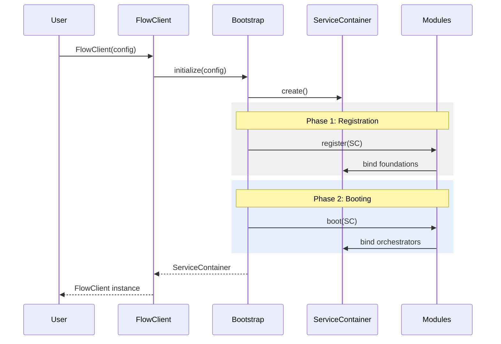

# Modular Registration Specification

This document defines the contract and implementation strategy for the **Modular Provider Pattern** within StreamFlow.

---

## 1. The AppModule Contract

Every subsystem must implement this interface to participate in the unified bootstrapping process.

```python
from abc import ABC, abstractmethod
from typing import TYPE_CHECKING

if TYPE_CHECKING:
    from src.app.context import ServiceContainer

class AppModule(ABC):
    """
    The Port for Subsystem Initialization.
    """
    
    @abstractmethod
    def register(self, container: 'ServiceContainer'):
        """
        Phase 1: Foundations.
        Instantiate registries, catalogs, and basic services.
        No cross-module dependency logic allowed here.
        """
        pass

    @abstractmethod
    def boot(self, container: 'ServiceContainer'):
        """
        Phase 2: Orchestration.
        Instantiate Managers and Runners that require fully initialized 
        registries and services from other modules.
        """
        pass
```

---

## 2. Module Implementations

### A. ConfigModule (Foundations)
Handles the initialization and resolution of global application settings.

```python
class ConfigModule(AppModule):
    def __init__(self, overrides: dict):
        self.overrides = overrides

    def register(self, container: 'ServiceContainer'):
        # Instantiate the raw configuration model
        config = AppConfig(**(self.overrides or {}))
        container.bind("config", config)

    def boot(self, container: 'ServiceContainer'):
        # No complex wiring needed for config
        pass
```

### B. StreamModule (Core I/O)
Responsible for identity resolution and storage adapters.

```python
class StreamModule(AppModule):
    def register(self, container: 'ServiceContainer'):
        container.bind("stream_registry", StreamRegistry())
        container.bind("resource_catalog", ResourceCatalog())
        container.bind("settings_resolver", SettingsResolver())
        
        # Self-Registering Infrastructure
        reg = container.get("stream_registry")
        reg.register("posix", PosixFileStream, policy=PosixFilePolicy())
        reg.register("file", PosixFileStream, policy=PosixFilePolicy())
        reg.register("http", HttpStream)
        
        cat = container.get("resource_catalog")
        cat.register("posix", PosixResourceBoundary())

    def boot(self, container: 'ServiceContainer'):
        # Requires Registry, Catalog, and Resolver from Phase 1
        factory = ResourceFactory(
            catalog=container.get("resource_catalog"),
            registry=container.get("stream_registry")
        )
        
        manager = StreamManager(
            registry=container.get("stream_registry"),
            factory=factory,
            catalog=container.get("resource_catalog"),
            app_config=container.config,
            resolver=container.get("settings_resolver")
        )
        
        container.bind("stream_manager", manager)
```

### C. PipelineModule (Workflows)
Responsible for transformation logic and execution engines.

```python
class PipelineModule(AppModule):
    def register(self, container: 'ServiceContainer'):
        container.bind("engine_registry", EngineRegistry())

    def boot(self, container: 'ServiceContainer'):
        # Depends on the manager created in StreamModule.boot()
        runner = PipelineRunner(
            manager=container.get("stream_manager"),
            engine_registry=container.get("engine_registry")
        )
        
        container.bind("pipeline_runner", runner)
```

### D. ObservabilityModule (Example)
Responsible for logging and traceability.

```python
class ObservabilityModule(AppModule):
    def register(self, container: 'ServiceContainer'):
        container.bind("trace_provider", TraceabilityProvider())

    def boot(self, container: 'ServiceContainer'):
        pass
```

---

## 3. The Bootstrap Process

### 3.1 Order of Operations (Call Flow)
1.  **User/Application:** Calls `FlowClient(config=...)`.
2.  **FlowClient:** Instantiates `Bootstrap` and calls `initialize(config)`.
3.  **Bootstrap:**
    *   Creates a new `ServiceContainer(config)`.
    *   Instantiates a list of `AppModule` objects (Config, Stream, Pipeline, etc.).
    *   **Loop 1 (Register):** Calls `.register(container)` on every module. Foundations are built.
    *   **Loop 2 (Boot):** Calls `.boot(container)` on every module. Orchestrators are wired.
4.  **Bootstrap:** Returns the fully-wired `ServiceContainer`.
5.  **FlowClient:** Stores the container and exposes user-facing methods.

### 3.2 Refactored Bootstrap Class

```python
class Bootstrap:
    """
    The Composition Root.
    Orchestrates the multi-phase modular initialization.
    """
    @staticmethod
    def initialize(config_overrides: dict) -> ServiceContainer:
        # 1. Initialize the central container
        # We handle config first to ensure it's available to modules
        config_module = ConfigModule(config_overrides)
        container = ServiceContainer()
        
        # 2. Define the Module List (The Order Matters!)
        modules = [
            config_module,
            ObservabilityModule(),
            StreamModule(),
            PipelineModule()
        ]

        # 3. Phase 1: Registration (Foundations)
        for module in modules:
            module.register(container)

        # 4. Phase 2: Booting (Wiring)
        for module in modules:
            module.boot(container)

        return container
```

### 3.3 Source Code Audit & Refactor Summary

| File | Change Required | Logic to Move |
| :--- | :--- | :--- |
| `src/app/bootstrap.py` | Replace entire `initialize` method. | Move all hardcoded `register()` calls and `Manager` instantiation into `StreamModule` and `ConfigModule`. |
| `src/app/context.py` | Rename `AppContext` to `ServiceContainer`. | Change from a frozen dataclass to a dynamic dictionary-backed container. |
| `src/app/stream_client.py` | Refactor `__init__` and rename class. | Update to use the `ServiceContainer` instead of the raw `StreamManager`. |

---

## 4. User-Client Refactor

### 4.1 Class Renaming Suggestions
Since the library now supports more than just "Streams" (specifically the new Pipeline subsystem), the name `StreamClient` is too narrow.

**Suggested Names:**
1.  **`FlowClient`**: Short, professional, and reflects the data-flow nature of both streams and pipelines.
2.  **`StreamFlow`**: Matches the project name; clean and recognizable.
3.  **`PipelineClient`**: Better for the pipeline focus, but ignores simple stream I/O.

**Selected Name:** **`FlowClient`** (or `StreamFlow` if used as a static entry point).

### 4.2 Implementation Changes
- **Internal Storage:** Replace `self._manager` with `self._container`.
- **Delegation:** User methods will now delegate to specific orchestrators within the container.

```python
class FlowClient:
    def __init__(self, config=None):
        self._container = Bootstrap.initialize(config)

    def read(self, uri, **overrides):
        # Delegate to StreamManager
        return self._container.stream_manager.read(uri, **overrides)

    def pipeline(self, uri):
        # Delegate to PipelineRunner
        return PipelineBuilder(
            runner=self._container.pipeline_runner,
            initial_source_uri=uri
        )
```

---

## 5. Summary Diagram


