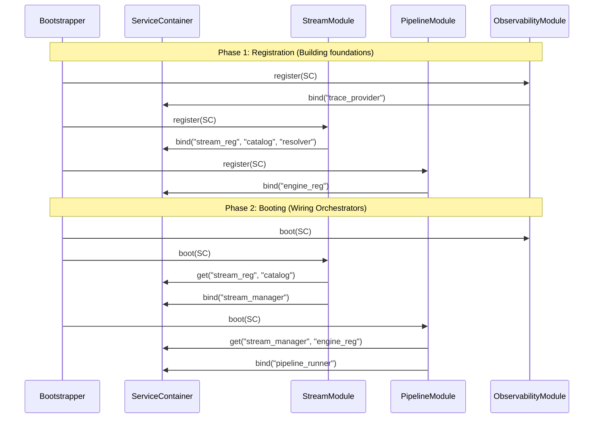

# Modular Registration Specification

This document defines the contract and implementation strategy for the **Modular Provider Pattern** within StreamFlow.

---

## 1. The AppModule Contract

Every subsystem must implement this interface to participate in the unified bootstrapping process.

```python
from abc import ABC, abstractmethod
from typing import TYPE_CHECKING

if TYPE_CHECKING:
    from src.app.context import ServiceContainer

class AppModule(ABC):
    """
    The Port for Subsystem Initialization.
    """
    
    @abstractmethod
    def register(self, container: 'ServiceContainer'):
        """
        Phase 1: Foundations.
        Instantiate registries, catalogs, and basic services.
        No cross-module dependency logic allowed here.
        """
        pass

    @abstractmethod
    def boot(self, container: 'ServiceContainer'):
        """
        Phase 2: Orchestration.
        Instantiate Managers and Runners that require fully initialized 
        registries and services from other modules.
        """
        pass
```

---

## 2. Module Implementations

### A. StreamModule (Core I/O)
Responsible for identity resolution and storage adapters.

```python
class StreamModule(AppModule):
    def register(self, container: 'ServiceContainer'):
        # 1. Foundations
        container.bind("stream_registry", StreamRegistry())
        container.bind("resource_catalog", ResourceCatalog())
        container.bind("settings_resolver", SettingsResolver())
        
        # 2. Self-Registering Infrastructure
        reg = container.get("stream_registry")
        reg.register("posix", PosixFileStream, policy=PosixFilePolicy())
        reg.register("http", HttpStream)
        
        cat = container.get("resource_catalog")
        cat.register("posix", PosixResourceBoundary())

    def boot(self, container: 'ServiceContainer'):
        # 3. Orchestration
        # Requires Registry, Catalog, and Resolver from Phase 1
        factory = ResourceFactory(
            catalog=container.get("resource_catalog"),
            registry=container.get("stream_registry")
        )
        
        manager = StreamManager(
            registry=container.get("stream_registry"),
            factory=factory,
            catalog=container.get("resource_catalog"),
            app_config=container.config,
            resolver=container.get("settings_resolver")
        )
        
        container.bind("stream_manager", manager)
```

### B. PipelineModule (Workflows)
Responsible for transformation logic and execution engines.

```python
class PipelineModule(AppModule):
    def register(self, container: 'ServiceContainer'):
        # 1. Foundations
        container.bind("engine_registry", EngineRegistry())
        
        # 2. Self-Registering Infrastructure
        # engine_reg = container.get("engine_registry")
        # engine_reg.register("local", LocalPipelineEngine)

    def boot(self, container: 'ServiceContainer'):
        # 3. Orchestration
        # Requires StreamManager from StreamModule's boot phase
        runner = PipelineRunner(
            manager=container.get("stream_manager"),
            engine_registry=container.get("engine_registry")
        )
        
        container.bind("pipeline_runner", runner)
```

### C. ObservabilityModule (Example 3rd Module)
Responsible for logging, telemetry, and health monitoring.

```python
class ObservabilityModule(AppModule):
    def register(self, container: 'ServiceContainer'):
        # 1. Foundations
        # Bind the provider that ensures all components have a trace ID
        container.bind("trace_provider", TraceabilityProvider())

    def boot(self, container: 'ServiceContainer'):
        # 2. Cross-Module Integration
        # We might "wrap" the StreamManager with a logging decorator 
        # or register a global error handler here.
        pass
```

---

## 3. Registration Mechanism & Order

### A. The Mechanism
Modules use **Explicit Dependency Injection** via the `ServiceContainer`.
*   **Encapsulated Logic:** The `StreamModule` internally knows which adapters (`Posix`, `Http`) to register into its own registry.
*   **Key-Value Binding:** Dependencies are stored under string keys (e.g., `"stream_manager"`) to allow dynamic lookups without circular imports.
*   **Self-Assembly:** Each module is a "Black Box" to the Bootstrapper; the Bootstrapper only knows to call `register()` then `boot()`.

### B. The Order of Assembly
The Bootstrapper executes in two distinct loops across all modules:

1.  **Register Loop (All Modules):** 
    *   `ObservabilityModule.register()`
    *   `StreamModule.register()`
    *   `PipelineModule.register()`
2.  **Boot Loop (All Modules):**
    *   `ObservabilityModule.boot()`
    *   `StreamModule.boot()`
    *   `PipelineModule.boot()`

---

## 4. Initialization Summary

### Sequence Diagram



### Key Rules
- **No Phase-1 Lookups:** A module must never call `container.get()` in the `register` phase for a dependency owned by another module.
- **Ordered Booting:** Modules are booted in the order they are defined. `PipelineModule` must come after `StreamModule` because it depends on the `StreamManager`.
- **Single Source of Truth:** The `ServiceContainer` is the only object passed between modules.
