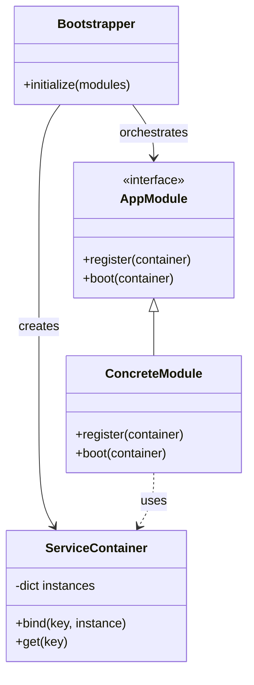
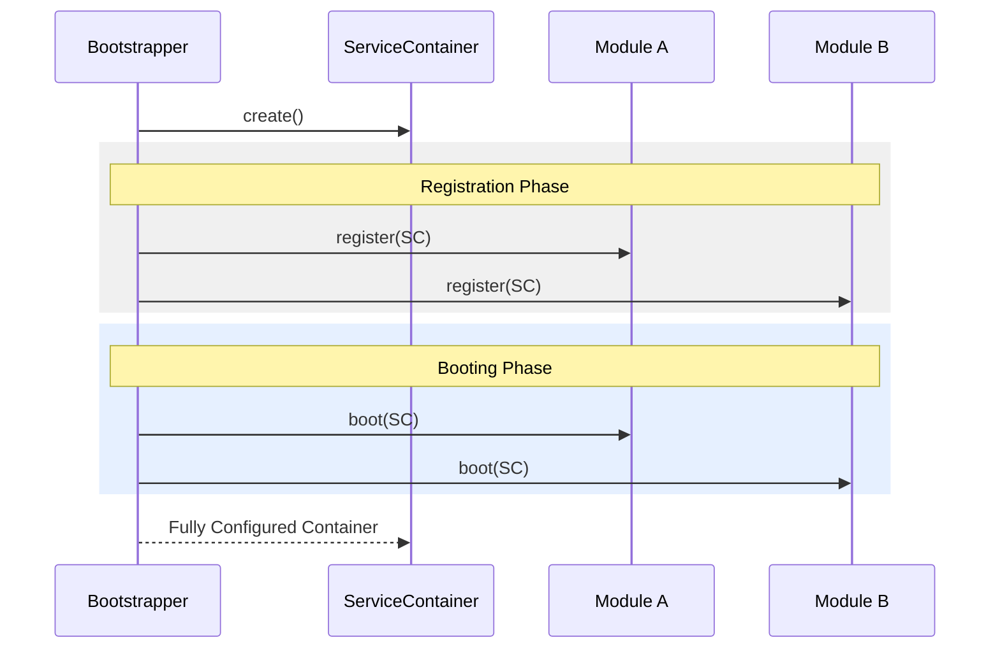

# The Provider (Module) Pattern Guide

## Concept Summary
The **Provider (Module) Pattern** is an architectural strategy for decoupling system initialization from business logic. Instead of a single "God Class" that knows how to build every component, the responsibility is delegated to specialized **Modules** (Providers).

Each module is responsible for its own "tree" of dependencies, registering them into a central **Service Container**.

### Core Components
1.  **Service Container:** A central registry that stores and provides access to long-lived objects (services).
2.  **App Module (The Port):** An interface that defines how a module interacts with the container.
3.  **Bootstrapper (The Orchestrator):** A class that iterates through all modules to perform the two-phase initialization.

---

## Two-Phase Initialization

To avoid dependency resolution issues, initialization is split into two distinct phases:

1.  **Phase 1: Registration:** Every module instantiates its "Foundations" (Registries, simple Services) and binds them to the container. *No logic that depends on other modules should occur here.*
2.  **Phase 2: Booting (Wiring):** Once all foundations are in the container, every module instantiates its "Orchestrators" (Use Cases, complex Services) that may require dependencies from other modules.

---

## Simple Python Example

### 1. The Service Container
```python
class ServiceContainer:
    def __init__(self):
        self._instances = {}

    def bind(self, key, instance):
        self._instances[key] = instance

    def get(self, key):
        return self._instances.get(key)
```

### 2. The Module Interface
```python
from abc import ABC, abstractmethod

class AppModule(ABC):
    @abstractmethod
    def register(self, container: ServiceContainer):
        """Phase 1: Create raw dependencies."""
        pass

    @abstractmethod
    def boot(self, container: ServiceContainer):
        """Phase 2: Wire complex dependencies."""
        pass
```

### 3. A Concrete Module Implementation
```python
class EmailModule(AppModule):
    def register(self, container: ServiceContainer):
        # Create foundational element
        container.bind("email_template_engine", TemplateEngine())

    def boot(self, container: ServiceContainer):
        # Create orchestrator that depends on other modules
        # (e.g., depends on a Logger from the CoreModule)
        logger = container.get("logger")
        engine = container.get("email_template_engine")
        
        container.bind("email_service", EmailService(engine, logger))
```

---

## Visualizing the Pattern

### Class Diagram



### Initialization Flow



---

## Why Use This Pattern?

- **Encapsulation:** The main application doesn't need to know *how* the email service is built, just that it's in the container.
- **Separation of Concerns:** The Email system's initialization logic stays within the `EmailModule`.
- **Order Guarantee:** The two-phase approach ensures that no service tries to access a dependency that hasn't been created yet.
- **Scalability:** Adding a new subsystem is as simple as creating a new module and adding it to the bootstrapper's list.
