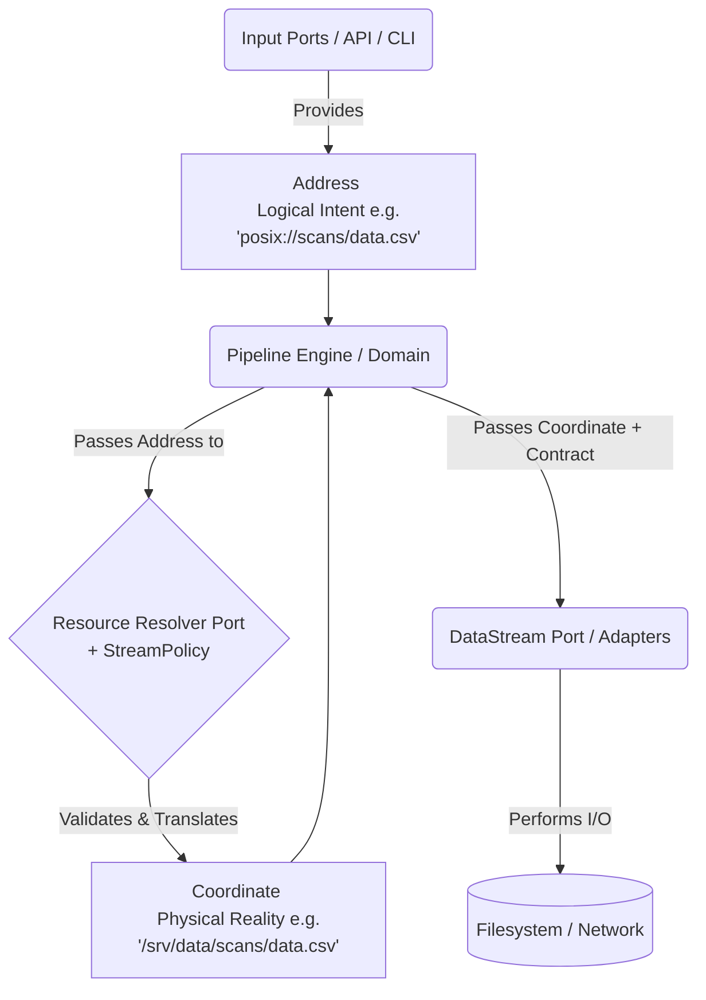

# Stream Subsystem Refactoring & ResourceIdentity Integration

This document outlines the strategy for refactoring `StreamContract`, `StreamPolicy`, and the `DataStream` adapters to fully leverage the new `ResourceIdentity` subsystem (`Address` vs `Coordinate`).

## 1. Architectural Implications: Ports vs. Domain Models

### Moving `StreamContract` and `StreamPolicy`
**a) Would this violate the adapter pattern?**
No. In Hexagonal Architecture, the Domain defines the data structures (Value Objects) it passes to the Ports. If `StreamContract` is purely a data structure representing the *intent* of the stream (e.g., `chunk_size`), it belongs in the Domain. The *Adapter* implements the Port (`DataStream`) and consumes the Domain Model (`StreamContract`). 

**b) Advantages of keeping them in `ports/`:**
Keeping them in `ports/` implies they are part of the interface boundary rather than core business rules. The main advantage is preventing infrastructure-specific concepts from leaking into the domain. If Adapters need highly tailored implementations, keeping the base contract/policy in `ports/` establishes them strictly as contracts for the infrastructure to fulfill, rather than domain concepts.

**c) Edge-cases requiring tailored implementations:**
Adapters absolutely require tailored extensions. For example:
- `PosixFileAdapter` needs `file_mode` (e.g., `wb`, `rb`) and `permissions` (e.g., `0o644`).
- `S3Adapter` might need `multipart_threshold` or `encryption_key`.
- `HttpAdapter` might need `timeout` or `retry_strategy`.
If the base `StreamContract` moves to the Domain, it must remain purely generic (e.g., `chunk_size`). The Adapters will still need to define their own specific Contract subclasses within `src/infrastructure/adapters/`.

### The Flexibility Requirement
The decision of where to place Contract and Policy hinges on flexibility:
- **StreamContract:** Needs to be an extensible Blueprint. The Domain defines the Base Blueprint (`src/app/domain/models/streams/stream_contract.py`), but the Infrastructure defines the Concrete Blueprints. 
- **StreamPolicy:** Requires a split. The Domain defines the *Rules* (Access Control, Allowed Realms), while the Port defines the *Resolution Mechanism* (Translating a logical `Address` to a physical `Coordinate`). We may need a `ResourceResolver` Port separate from a `Policy` Model.

## 2. The Coupling Problem

Currently, `DataStream` establishes the contract loosely:
```python
def __init__(self, uri: StreamLocation, context: StreamContext, **settings):
```
This implies the caller passes raw kwargs (`**settings`), and the Adapter dynamically instantiates its specific `_settings_contract`.

**Implications of Refactoring:**
By migrating to the new `ResourceIdentity` subsystem and moving Contracts to models, we can enforce strong coupling and eliminate the `**settings` magic. The Port interface becomes explicit:
```python
def __init__(self, coordinate: Coordinate, context: StreamContext, contract: StreamContract):
```
This forces the Domain (e.g., the Pipeline Engine) to explicitly construct the correct `StreamContract` (or a specific subclass) *before* passing it to the Adapter. It shifts the validation failure left, catching invalid settings before the Adapter is even instantiated.

## 3. ResourceIdentity Data Flow Diagram

The cleavage between Domain and Infrastructure is now explicitly defined by the type of `ResourceIdentity` passed.



### Component Acceptance Rules:
1. **Input Ports & App Services:** Accept `Address` or raw strings. They represent the outside world asking for something.
2. **Domain Models & Orchestrators:** Work with `Address` until resolution is required.
3. **Resolvers/Policies:** Accept `Address`, validate against rules, and emit `Coordinate`.
4. **Output Ports & Adapters:** Accept **ONLY** `Coordinate`. An Adapter should never perform logical resolution or string parsing; it assumes physical reality has been verified.

## 4. Refactoring the Input Port: ResourceBoundary

The `ResourceBoundary` acts as the security "gatekeeper." It is responsible for ensuring that a logical intent does not escape its authorized "cage" (anchor).

### Mapping to the New Identity Subsystem
The current `ResourceBoundary` uses `LogicalURI` and `PhysicalPath`. These should be refactored to align with the `Address` and `Coordinate` types:

*   **`Address` (fmr LogicalURI):** The incoming request (e.g., `registry://scans/01.xml`).
*   **`Coordinate` (fmr PhysicalPath):** The secured, resolved physical location (e.g., `/srv/data/scans/01.xml`).
*   **`Anchor` (Generic T):** Should be typed as a `Coordinate` representing the root of the "cage."

### Proposed Refined Interface
```python
class ResourceBoundary(ABC):
    @abstractmethod
    def resolve(self, address: Address, anchor: Coordinate) -> Coordinate:
        """
        Translates an Address into a secured Coordinate.
        1. Decomposes the Address.
        2. Merges with the Anchor Coordinate.
        3. Validates safety (no traversal).
        """
        pass

    @abstractmethod
    def is_safe(self, resource: Coordinate, anchor: Coordinate) -> bool:
        """
        Final containment check. Ensures the resource is physically 
        under the anchor in the hierarchy.
        """
        pass
```

### Refactoring Rationale
1.  **Bridging Reality:** The Boundary is the specific component that performs the mutation from `Address` (Intent) to `Coordinate` (Reality).
2.  **Domain vs. Port Cleavage:** While the *policy* (which anchor to use) is a Domain concept, the *act of resolution and safety validation* (checking symlinks, path normalization) is an Infrastructure/Port concern because it interacts with the specific mechanics of the OS or protocol.
3.  **Realm Specificity:** We should move toward Realm-specific boundaries (e.g., `LocalResourceBoundary`, `NetworkResourceBoundary`) rather than a single generic one. This allows the `is_safe` logic to be tailored to the medium (filesystem vs. URL paths).