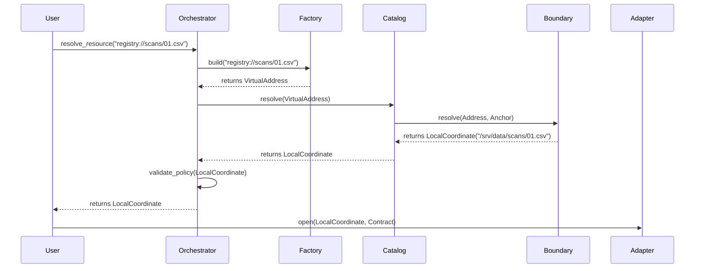

# Stream Subsystem Refactoring & ResourceIdentity Integration

**STATUS: RESOURCE IDENTITY REFACTOR COMPLETE (March 2026)**

This document outlines the strategy and current progress for refactoring the `StreamFlow` resource and stream subsystems to fully leverage the high-fidelity `Address` vs. `Coordinate` architecture.

## 1. Status Update: ResourceIdentity Subsystem

The core **ResourceIdentity Subsystem** has been fully refactored and verified. The system now treats "Intent" (Address) and "Physical Reality" (Coordinate) as distinct domain entities, governed by realm-specific security boundaries.

### ✅ Completion Checklist:
- [x] **Domain Models**: Defined `Address` and `Coordinate` base classes and realm-specific implementations (`Local`, `Network`, `Memory`, `Synthetic`, `Virtual`).
- [x] **Refined Ports**: Created `ResourceBoundary` input ports refined by realm (e.g., `LocalResourceBoundary`, `NetworkResourceBoundary`).
- [x] **Template Method Implementation**: Implemented robust concrete logic in Ports for sanitization and security, delegating OS-specific math to thin adapters.
- [x] **Infrastructure Adapters**: Updated `PosixResourceBoundary` and created `HttpResourceBoundary` to fulfill the refined port contracts.
- [x] **ResourceCatalog**: Refactored as a "Librarian" for the `registry://` protocol, managing anchors and boundaries.
- [x] **ResourceFactory**: Implemented a registry-driven classification engine that avoids hardcoded protocol lists.
- [x] **ResourceOrchestrator**: Created a facade for the subsystem to handle the full promotion lifecycle: *Classify -> Resolve -> Map -> Validate*.
- [x] **Unit & Integration Testing**: 30+ tests verifying security, resolution, and promotion across all 5 realms.
- [x] **Export Cleanup**: Unified service exports in `src/app/domain/services/resource_identity/__init__.py`.

---

## 2. Next Phase: Stream Subsystem Refactoring

The focus now shifts to the **Stream Subsystem**, which consumes the validated `Coordinate` objects produced by the identity subsystem.

### Targeted Refactoring:
1.  **`DataStream` Port**: Update all adapters to accept `Coordinate` instead of the legacy `StreamLocation`.
2.  **`StreamContract`**: Refactor from loosely typed kwargs to strictly typed dataclasses.
3.  **`StreamManager`**: Refactor the primary use case to utilize the `ResourceOrchestrator` for all resolution and policy checks.

---

## 3. Architectural Implications (Archive/Reference)

*(The following sections are preserved for architectural context during the transition period)*

### Component Acceptance Rules (Current):
1. **Input Ports & App Services:** Accept `Address` or raw strings.
2. **Domain Models & Orchestrators:** Work with `Address` until resolution is required.
3. **Resolvers/Policies:** Accept `Address`, validate against rules, and emit `Coordinate`.
4. **Output Ports & Adapters:** Accept **ONLY** `Coordinate`. An Adapter should never perform logical resolution or string parsing.

### Flow Diagram: String to Stream

