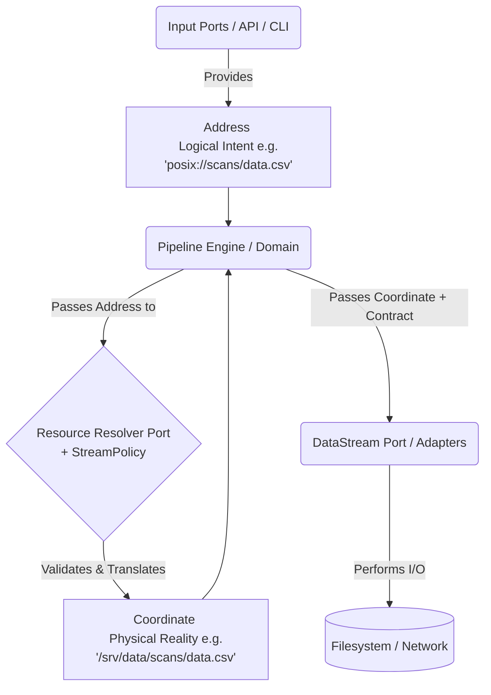
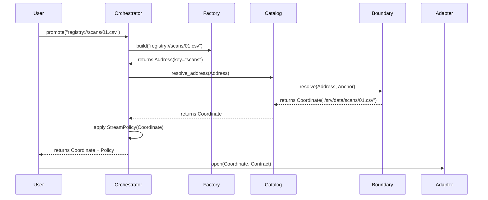
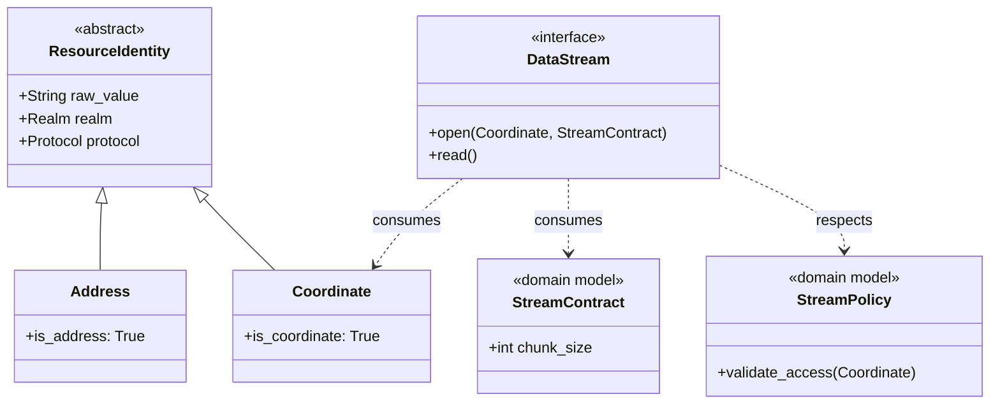

# Stream Subsystem Refactoring & ResourceIdentity Integration

This document outlines the strategy for refactoring `StreamContract`, `StreamPolicy`, and the `DataStream` adapters to fully leverage the new `ResourceIdentity` subsystem (`Address` vs `Coordinate`).

## 1. Architectural Implications: Ports vs. Domain Models

### Moving `StreamContract` and `StreamPolicy`
**a) Would this violate the adapter pattern?**
No. In Hexagonal Architecture, the Domain defines the data structures (Value Objects) it passes to the Ports. If `StreamContract` is purely a data structure representing the *intent* of the stream (e.g., `chunk_size`), it belongs in the Domain. The *Adapter* implements the Port (`DataStream`) and consumes the Domain Model (`StreamContract`). 

**b) Advantages of keeping them in `ports/`:**
Keeping them in `ports/` implies they are part of the interface boundary rather than core business rules. The main advantage is preventing infrastructure-specific concepts from leaking into the domain. If Adapters need highly tailored implementations, keeping the base contract/policy in `ports/` establishes them strictly as contracts for the infrastructure to fulfill, rather than domain concepts.

**c) Edge-cases requiring tailored implementations:**
Adapters absolutely require tailored extensions. For example:
- `PosixFileAdapter` needs `file_mode` (e.g., `wb`, `rb`) and `permissions` (e.g., `0o644`).
- `S3Adapter` might need `multipart_threshold` or `encryption_key`.
- `HttpAdapter` might need `timeout` or `retry_strategy`.
If the base `StreamContract` moves to the Domain, it must remain purely generic (e.g., `chunk_size`). The Adapters will still need to define their own specific Contract subclasses within `src/infrastructure/adapters/`.

### The Flexibility Requirement
The decision of where to place Contract and Policy hinges on flexibility:
- **StreamContract:** Needs to be an extensible Blueprint. The Domain defines the Base Blueprint (`src/app/domain/models/streams/stream_contract.py`), but the Infrastructure defines the Concrete Blueprints. 
- **StreamPolicy:** Requires a split. The Domain defines the *Rules* (Access Control, Allowed Realms), while the Port defines the *Resolution Mechanism* (Translating a logical `Address` to a physical `Coordinate`). We may need a `ResourceResolver` Port separate from a `Policy` Model.

## 2. The Coupling Problem

Currently, `DataStream` establishes the contract loosely:
```python
def __init__(self, uri: StreamLocation, context: StreamContext, **settings):
```
This implies the caller passes raw kwargs (`**settings`), and the Adapter dynamically instantiates its specific `_settings_contract`.

**Implications of Refactoring:**
By migrating to the new `ResourceIdentity` subsystem and moving Contracts to models, we can enforce strong coupling and eliminate the `**settings` magic. The Port interface becomes explicit:
```python
def __init__(self, coordinate: Coordinate, context: StreamContext, contract: StreamContract):
```
This forces the Domain (e.g., the Pipeline Engine) to explicitly construct the correct `StreamContract` (or a specific subclass) *before* passing it to the Adapter. It shifts the validation failure left, catching invalid settings before the Adapter is even instantiated.

## 3. ResourceIdentity Data Flow Diagram

The cleavage between Domain and Infrastructure is now explicitly defined by the type of `ResourceIdentity` passed.



### Component Acceptance Rules:
1. **Input Ports & App Services:** Accept `Address` or raw strings. They represent the outside world asking for something.
2. **Domain Models & Orchestrators:** Work with `Address` until resolution is required.
3. **Resolvers/Policies:** Accept `Address`, validate against rules, and emit `Coordinate`.
4. **Output Ports & Adapters:** Accept **ONLY** `Coordinate`. An Adapter should never perform logical resolution or string parsing; it assumes physical reality has been verified.

## 4. Refactoring the Input Port: ResourceBoundary

The `ResourceBoundary` acts as the security "gatekeeper." It is responsible for ensuring that a logical intent does not escape its authorized "cage" (anchor).

### Mapping to the New Identity Subsystem
The current `ResourceBoundary` uses `LogicalURI` and `PhysicalPath`. These should be refactored to align with the `Address` and `Coordinate` types:

*   **`Address` (fmr LogicalURI):** The incoming request (e.g., `registry://scans/01.xml`).
*   **`Coordinate` (fmr PhysicalPath):** The secured, resolved physical location (e.g., `/srv/data/scans/01.xml`).
*   **`Anchor` (Generic T):** Should be typed as a `Coordinate` representing the root of the "cage."

### Proposed Refined Interface
```python
class ResourceBoundary(ABC):
    @abstractmethod
    def resolve(self, address: Address, anchor: Coordinate) -> Coordinate:
        """
        Translates an Address into a secured Coordinate.
        1. Decomposes the Address.
        2. Merges with the Anchor Coordinate.
        3. Validates safety (no traversal).
        """
        pass

    @abstractmethod
    def is_safe(self, resource: Coordinate, anchor: Coordinate) -> bool:
        """
        Final containment check. Ensures the resource is physically 
        under the anchor in the hierarchy.
        """
        pass
```

## 5. Refactoring Resource Subsystem Services

The refactoring of the Resource Subsystem involves promoting services from handling raw strings and loosely typed URIs to working with the high-fidelity `Address` and `Coordinate` models.

### ResourceCatalog: The Librarian
The `ResourceCatalog` moves from managing `LogicalURI` to governing the translation of `Address` to `Coordinate`.

```python
class ResourceCatalog:
    def __init__(self):
        # Maps ResourceKey (e.g. "scans") -> Anchor Coordinate
        self._anchors: Dict[ResourceKey, Coordinate] = {}
        self._boundaries: Dict[str, ResourceBoundary] = {}
        self._key_protocols: Dict[ResourceKey, str] = {}

    def resolve_address(self, address: Address) -> Coordinate:
        """
        Translates an Address into a secured, physical Coordinate.
        """
        key = address.key
        protocol = self.get_protocol(key)
        anchor = self._get_anchor(key)

        boundary = self._boundaries[protocol]

        # Boundary ensures the Address is resolved safely within the Anchor Coordinate
        return boundary.resolve(address, anchor)
```

### ResourceFactory: The Classification Engine
The `ResourceFactory` becomes the entry point for "Promoting" raw strings into domain-ready `Address` objects or direct `Coordinate` objects.

```python
class ResourceFactory:
    def build(self, uri: str) -> Union[Address, Coordinate]:
        """
        Determines if a URI is a Logical Intent (Address) 
        or a Physical Reality (Coordinate).
        """
        if "://" not in uri:
            raise SecurityViolation(f"Unqualified identifier: {uri}")

        # In the new model, we first create a candidate Address
        candidate = Address.from_string(uri)

        # 1. Governed Realm: registry://
        if candidate.protocol == "registry":
            return candidate 

        # 2. Discovered Realm: If catalog knows the key
        if self._catalog.has_resource(candidate.protocol, candidate.key):
            return candidate

        # 3. Direct Realm: If it's a known physical protocol (e.g. s3://, file://)
        # We promote directly to a Coordinate
        return Coordinate.from_string(uri)
```

### ResourceOrchestrator: The Subsystem Warehouse
The `ResourceOrchestrator` coordinates the Factory, Catalog, and Policies to deliver a ready-to-use `Coordinate` and its corresponding Adapter Blueprint to the Pipeline Engine.

```python
class ResourceOrchestrator:
    def __init__(self, factory: ResourceFactory, catalog: ResourceCatalog, registry: StreamRegistry):
        self._factory = factory
        self._catalog = catalog
        self._registry = registry

    def prepare_resource(self, uri: str, policy: Optional[StreamPolicy] = None) -> Tuple[Coordinate, AdapterBlueprint]:
        """
        The full promotion lifecycle:
        1. String -> Address/Coordinate (via Factory)
        2. Address -> Coordinate (via Catalog/Boundary if needed)
        3. Blueprint Mapping: Determine the correct Adapter for the protocol.
        4. Coordinate -> Validated Reality (via Policy)
        """
        item = self._factory.build(uri)
        
        # 1 & 2. Resolution
        coordinate = self._catalog.resolve_address(item) if isinstance(item, Address) else item
        
        # 3. Blueprint Mapping
        blueprint = self._registry.get_blueprint(coordinate.protocol)
        
        # 4. Policy Enforcement
        if policy:
            policy.validate_access(coordinate)
            
        return coordinate, blueprint
```

## 6. ResourceBoundary: Placement and Coupling

### Where does it belong?
The `ResourceBoundary` should remain in `src/app/ports/input/`. 

**Rationale:**
- **As a Port:** It defines a contract for security enforcement that varies by infrastructure (POSIX vs. S3 vs. HTTP). 
- **Coupling:** It should be **tightly coupled to the Identity models** (`Address`, `Coordinate`) but **loosely coupled to the Catalog**. The Catalog *uses* the Boundary, but the Boundary should not know about the Catalog's internal registry or key-mapping logic. 
- **Security Cleavage:** By keeping the Boundary in `ports/`, we ensure that the logic for "How do I check a symlink?" or "How do I normalize a URL path?" stays in the infrastructure layer, while the Domain simply asks for a "Safe Coordinate."

## 7. Proposed Subsystem Diagrams

### Flow Diagram: String to Stream


### Class Diagram: The Refactored Relationship
