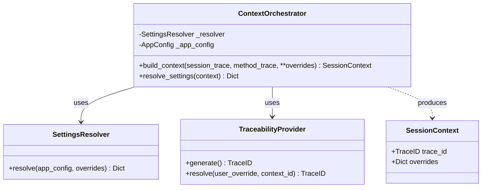
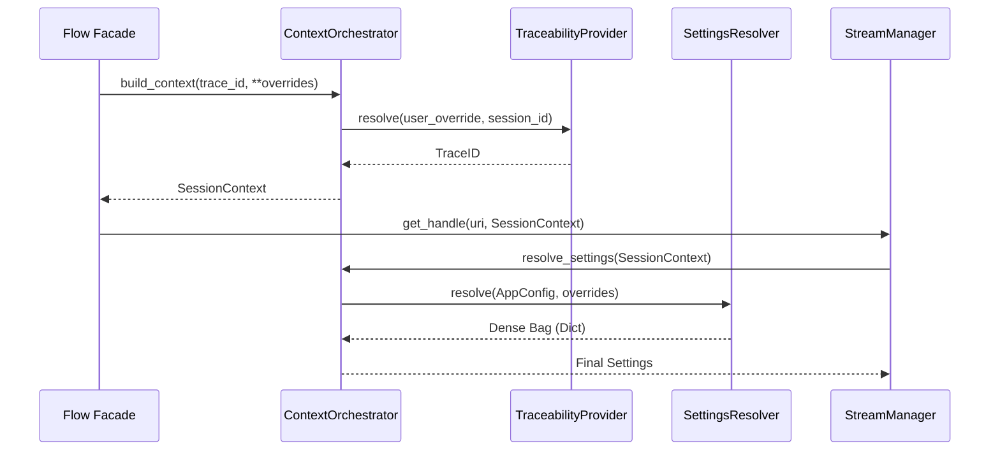

# Status Report: Session Context & Traceability Subsystem

**Last Updated:** Wednesday, March 18, 2026  
**Status:** Functional / Integration Required  
**Component:** `ContextOrchestrator` & `SessionContext`

---

## 1. Executive Summary
The Session Context subsystem is responsible for maintaining the "Passport" (traceability and ephemeral settings) that travels with every data stream. While the core logic is implemented, the subsystem is currently misaligned with the project's directory structure and naming conventions, leading to fragile imports and high cognitive load.

---

## 2. Key Findings

### A. Directory & Path Mismatches
The physical files for the subsystem have been moved to a specialized directory, but the rest of the application is still attempting to import them from the service root.
- **Physical Path:** `src/app/domain/services/session_context/orchestrator.py`
- **Attempted Import:** `from src.app.domain.services.context_orchestrator import ...`
- **Missing `__init__.py`:** The `session_context` directory lacks an `__init__.py`, making it impossible to import components cleanly.

### B. Naming Collision (Orchestrator Overload)
The system now has two primary "Orchestrators":
1.  **`ResourceOrchestrator`**: Handles Identity, Resolution, and Mapping (The "What").
2.  **`ContextOrchestrator`**: Handles Session, Traceability, and Settings (The "Who/How").
The similar naming makes the architecture harder to navigate for new developers.

### C. Implementation Gaps
The `StreamManager` is injected with the `ContextOrchestrator` but is not yet fully delegating its settings resolution logic to it, leading to redundant code in the `manager.py`.

---

## 3. Class Diagram (Existing)



---

## 4. Execution Flow (Settings Resolution)



---

## 5. Recommendations for Resolution

### 1. Renaming for Clarity
Rename `ContextOrchestrator` to **`SessionOrchestrator`**.
- **Rationale:** Distinguishes it clearly from the `ResourceOrchestrator`. It manages the *Session*, not the general *Context*.

### 2. Standardize Exports
Create `src/app/domain/services/session_context/__init__.py` and export the services.
```python
from .orchestrator import SessionOrchestrator
from .settings_resolver import SettingsResolver
from .traceability_provider import TraceabilityProvider
```

### 3. Fix Import Paths
Update `src/app/container.py` and `src/app/providers/config.py` to use the new standardized paths.

### 4. Bridge to StreamManager
Refactor `StreamManager` to strictly use the `SessionOrchestrator` for all its metadata and settings needs, removing internal dictionary merging.

---

## 6. Next Steps
- [ ] Implement directory cleanup and naming refactor.
- [ ] Update `StreamManager` to consume `SessionContext`.
- [ ] Verify with unit tests in `tests/unit/app/domain/services/session_context/`.
